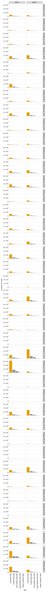

# Count variants in each sample
This Python Jupyter notebook counts occurrences of each barcode in each sample from Illumina barcode sequencing, and adds these counts to the codon variant table.

## Set up analysis
### Import Python modules.
Use [plotnine](https://plotnine.readthedocs.io/en/stable/) for ggplot2-like plotting.

The analysis relies heavily on the Bloom lab's [dms_variants](https://jbloomlab.github.io/dms_variants) package:


```python
import itertools
import multiprocessing
import multiprocessing.pool
import os
import warnings

import alignparse
import alignparse.targets

import dms_variants.codonvarianttable
from dms_variants.constants import CBPALETTE
import dms_variants.illuminabarcodeparser
import dms_variants.utils
import dms_variants.plotnine_themes

from IPython.display import display, HTML

import pandas as pd

from plotnine import *

import yaml
```

Set [plotnine](https://plotnine.readthedocs.io/en/stable/) theme to the gray-grid one defined in `dms_variants`:


```python
theme_set(dms_variants.plotnine_themes.theme_graygrid())
```

Versions of key software:


```python
print(f"Using alignparse version {alignparse.__version__}")
print(f"Using dms_variants version {dms_variants.__version__}")
```

    Using alignparse version 0.6.0
    Using dms_variants version 1.4.3


Ignore warnings that clutter output:


```python
warnings.simplefilter('ignore')
```

### Parameters for notebook
Read the configuration file:


```python
with open('config.yaml') as f:
    config = yaml.safe_load(f)
```

Make output directory if needed:


```python
os.makedirs(config['counts_dir'], exist_ok=True)
os.makedirs(config['figs_dir'], exist_ok=True)
```

## Input variant tables
Initialize the table of barcode-variant pairs from the respective `process_ccs` notebooks for each background.


```python
variants = pd.read_csv(config['codon_variant_table_file_EG5'], na_filter=None)
variants = variants.append(pd.read_csv(config['codon_variant_table_file_FLip'], na_filter=None))
variants = variants.append(pd.read_csv(config['codon_variant_table_file_BA286'], na_filter=None))

variants = variants.reset_index(drop=True)

display(HTML(variants.head().to_html(index=False)))
```


<table border="1" class="dataframe">
  <thead>
    <tr style="text-align: right;">
      <th>target</th>
      <th>library</th>
      <th>barcode</th>
      <th>variant_call_support</th>
      <th>codon_substitutions</th>
      <th>aa_substitutions</th>
      <th>n_codon_substitutions</th>
      <th>n_aa_substitutions</th>
    </tr>
  </thead>
  <tbody>
    <tr>
      <td>EG5</td>
      <td>pool1</td>
      <td>AAAAAAAAAAGATTGT</td>
      <td>3</td>
      <td>AGA179GGT</td>
      <td>R179G</td>
      <td>1</td>
      <td>1</td>
    </tr>
    <tr>
      <td>EG5</td>
      <td>pool1</td>
      <td>AAAAAAAAACAATTGT</td>
      <td>1</td>
      <td>AGA27ACT TTC134GGT</td>
      <td>R27T F134G</td>
      <td>2</td>
      <td>2</td>
    </tr>
    <tr>
      <td>EG5</td>
      <td>pool1</td>
      <td>AAAAAAAAACTATACA</td>
      <td>1</td>
      <td>CAA79TGG</td>
      <td>Q79W</td>
      <td>1</td>
      <td>1</td>
    </tr>
    <tr>
      <td>EG5</td>
      <td>pool1</td>
      <td>AAAAAAAAAGAAAGTT</td>
      <td>1</td>
      <td>TTG57GAT</td>
      <td>L57D</td>
      <td>1</td>
      <td>1</td>
    </tr>
    <tr>
      <td>EG5</td>
      <td>pool1</td>
      <td>AAAAAAAAAGACTTCT</td>
      <td>3</td>
      <td>GTT52GCT</td>
      <td>V52A</td>
      <td>1</td>
      <td>1</td>
    </tr>
  </tbody>
</table>


Are there any barcodes in the same library that are shared across targets?
If so, we need to get rid of those as they will be confounded in barcode parsing:


```python
dup_barcodes = (
    variants
    .groupby(['library', 'barcode'])
    .size()
    .rename('duplicate_count')
    .reset_index()
    .query('duplicate_count > 1')
    )

print('Here are duplicated barcodes:')
display(HTML(dup_barcodes.head().to_html(index=False)))

print(f"\nRemoving the {len(dup_barcodes)} duplicated barcodes."
      f"Started with {len(variants)} barcodes:")
variants = (
    variants
    .merge(dup_barcodes, on=['library', 'barcode'], how='outer')
    .query('duplicate_count.isnull()', engine='python')
    )
print(f"After removing duplicates, there are {len(variants)} barcodes.")
```

    Here are duplicated barcodes:


<table border="1" class="dataframe">
  <thead>
    <tr style="text-align: right;">
      <th>library</th>
      <th>barcode</th>
      <th>duplicate_count</th>
    </tr>
  </thead>
  <tbody>
    <tr>
      <td>pool1</td>
      <td>AAAAGTGAAAGAGTAC</td>
      <td>2</td>
    </tr>
    <tr>
      <td>pool1</td>
      <td>AAACAATAAATTATGA</td>
      <td>2</td>
    </tr>
    <tr>
      <td>pool1</td>
      <td>AAAGGACTTTTAGAAA</td>
      <td>2</td>
    </tr>
    <tr>
      <td>pool1</td>
      <td>AACCAGCGAAATCTAA</td>
      <td>2</td>
    </tr>
    <tr>
      <td>pool1</td>
      <td>ACAATTGAGGACAATG</td>
      <td>2</td>
    </tr>
  </tbody>
</table>


    
    Removing the 34 duplicated barcodes.Started with 512628 barcodes:
    After removing duplicates, there are 512560 barcodes.


Pull out a target sequence for matching to the barcode and flanking sequence regions. Note, in this pipeline this is ok because our different backgrounds don't have differing flanks or other features within the actual N16 region covered in Illumina sequencing. If ever placing in-line barcodes here in the future, we would need to modify this.


```python
# get wildtype gene sequence for primary target
targets = alignparse.targets.Targets(seqsfile=config['amplicons_EG5'],
                                     feature_parse_specs=config['feature_parse_specs_EG5'])
```

## Setup to parse barcodes
Read data frame with list of all barcode runs.


```python
# barcode runs with R1 files by semicolon string split
barcode_runs = (pd.read_csv(config['barcode_runs'])
                .assign(R1=lambda x: x['R1'].str.split('; '))
                )

display(HTML(barcode_runs.to_html(index=False)))
```


<table border="1" class="dataframe">
  <thead>
    <tr style="text-align: right;">
      <th>library</th>
      <th>sample</th>
      <th>sample_type</th>
      <th>sort_bin</th>
      <th>concentration</th>
      <th>date</th>
      <th>number_cells</th>
      <th>R1</th>
    </tr>
  </thead>
  <tbody>
    <tr>
      <td>pool1</td>
      <td>TiteSeq_01_bin1</td>
      <td>TiteSeq</td>
      <td>1</td>
      <td>1.0</td>
      <td>240125</td>
      <td>384974</td>
      <td>[/uufs/chpc.utah.edu/common/home/u6042467/starr-group1/sequencing/TNS/2024/240313_Illumina_OmiBA286-EG5-FLip_animal-polish_sarbeco-combo-polish/240125-exp1-s1-b1_R1_001.fastq.gz, /uufs/chpc.utah.edu/common/home/u6042467/starr-group1/sequencing/TNS/2024/240410_Illumina-v2_OmiBA286-EG5-FLip/240125-exp1-s1-b1_R1_001.fastq.gz]</td>
    </tr>
    <tr>
      <td>pool1</td>
      <td>TiteSeq_01_bin2</td>
      <td>TiteSeq</td>
      <td>2</td>
      <td>1.0</td>
      <td>240125</td>
      <td>860724</td>
      <td>[/uufs/chpc.utah.edu/common/home/u6042467/starr-group1/sequencing/TNS/2024/240313_Illumina_OmiBA286-EG5-FLip_animal-polish_sarbeco-combo-polish/240125-exp1-s1-b2_R1_001.fastq.gz, /uufs/chpc.utah.edu/common/home/u6042467/starr-group1/sequencing/TNS/2024/240410_Illumina-v2_OmiBA286-EG5-FLip/240125-exp1-s1-b2_R1_001.fastq.gz]</td>
    </tr>
    <tr>
      <td>pool1</td>
      <td>TiteSeq_01_bin3</td>
      <td>TiteSeq</td>
      <td>3</td>
      <td>1.0</td>
      <td>240125</td>
      <td>2596538</td>
      <td>[/uufs/chpc.utah.edu/common/home/u6042467/starr-group1/sequencing/TNS/2024/240313_Illumina_OmiBA286-EG5-FLip_animal-polish_sarbeco-combo-polish/240125-exp1-s1-b3_R1_001.fastq.gz, /uufs/chpc.utah.edu/common/home/u6042467/starr-group1/sequencing/TNS/2024/240410_Illumina-v2_OmiBA286-EG5-FLip/240125-exp1-s1-b3_R1_001.fastq.gz]</td>
    </tr>
    <tr>
      <td>pool1</td>
      <td>TiteSeq_01_bin4</td>
      <td>TiteSeq</td>
      <td>4</td>
      <td>1.0</td>
      <td>240125</td>
      <td>6350060</td>
      <td>[/uufs/chpc.utah.edu/common/home/u6042467/starr-group1/sequencing/TNS/2024/240313_Illumina_OmiBA286-EG5-FLip_animal-polish_sarbeco-combo-polish/240125-exp1-s1-b4_R1_001.fastq.gz, /uufs/chpc.utah.edu/common/home/u6042467/starr-group1/sequencing/TNS/2024/240410_Illumina-v2_OmiBA286-EG5-FLip/240125-exp1-s1-b4_R1_001.fastq.gz]</td>
    </tr>
    <tr>
      <td>pool1</td>
      <td>TiteSeq_02_bin1</td>
      <td>TiteSeq</td>
      <td>1</td>
      <td>2.0</td>
      <td>240125</td>
      <td>630205</td>
      <td>[/uufs/chpc.utah.edu/common/home/u6042467/starr-group1/sequencing/TNS/2024/240313_Illumina_OmiBA286-EG5-FLip_animal-polish_sarbeco-combo-polish/240125-exp1-s2-b1_R1_001.fastq.gz, /uufs/chpc.utah.edu/common/home/u6042467/starr-group1/sequencing/TNS/2024/240410_Illumina-v2_OmiBA286-EG5-FLip/240125-exp1-s2-b1_R1_001.fastq.gz]</td>
    </tr>
    <tr>
      <td>pool1</td>
      <td>TiteSeq_02_bin2</td>
      <td>TiteSeq</td>
      <td>2</td>
      <td>2.0</td>
      <td>240125</td>
      <td>837133</td>
      <td>[/uufs/chpc.utah.edu/common/home/u6042467/starr-group1/sequencing/TNS/2024/240313_Illumina_OmiBA286-EG5-FLip_animal-polish_sarbeco-combo-polish/240125-exp1-s2-b2_R1_001.fastq.gz, /uufs/chpc.utah.edu/common/home/u6042467/starr-group1/sequencing/TNS/2024/240410_Illumina-v2_OmiBA286-EG5-FLip/240125-exp1-s2-b2_R1_001.fastq.gz]</td>
    </tr>
    <tr>
      <td>pool1</td>
      <td>TiteSeq_02_bin3</td>
      <td>TiteSeq</td>
      <td>3</td>
      <td>2.0</td>
      <td>240125</td>
      <td>2854102</td>
      <td>[/uufs/chpc.utah.edu/common/home/u6042467/starr-group1/sequencing/TNS/2024/240313_Illumina_OmiBA286-EG5-FLip_animal-polish_sarbeco-combo-polish/240125-exp1-s2-b3_R1_001.fastq.gz, /uufs/chpc.utah.edu/common/home/u6042467/starr-group1/sequencing/TNS/2024/240410_Illumina-v2_OmiBA286-EG5-FLip/240125-exp1-s2-b3_R1_001.fastq.gz]</td>
    </tr>
    <tr>
      <td>pool1</td>
      <td>TiteSeq_02_bin4</td>
      <td>TiteSeq</td>
      <td>4</td>
      <td>2.0</td>
      <td>240125</td>
      <td>5742632</td>
      <td>[/uufs/chpc.utah.edu/common/home/u6042467/starr-group1/sequencing/TNS/2024/240313_Illumina_OmiBA286-EG5-FLip_animal-polish_sarbeco-combo-polish/240125-exp1-s2-b4_R1_001.fastq.gz, /uufs/chpc.utah.edu/common/home/u6042467/starr-group1/sequencing/TNS/2024/240410_Illumina-v2_OmiBA286-EG5-FLip/240125-exp1-s2-b4_R1_001.fastq.gz]</td>
    </tr>
    <tr>
      <td>pool1</td>
      <td>TiteSeq_03_bin1</td>
      <td>TiteSeq</td>
      <td>1</td>
      <td>3.0</td>
      <td>240125</td>
      <td>982344</td>
      <td>[/uufs/chpc.utah.edu/common/home/u6042467/starr-group1/sequencing/TNS/2024/240313_Illumina_OmiBA286-EG5-FLip_animal-polish_sarbeco-combo-polish/240125-exp1-s3-b1_R1_001.fastq.gz, /uufs/chpc.utah.edu/common/home/u6042467/starr-group1/sequencing/TNS/2024/240410_Illumina-v2_OmiBA286-EG5-FLip/240125-exp1-s3-b1_R1_001.fastq.gz]</td>
    </tr>
    <tr>
      <td>pool1</td>
      <td>TiteSeq_03_bin2</td>
      <td>TiteSeq</td>
      <td>2</td>
      <td>3.0</td>
      <td>240125</td>
      <td>960420</td>
      <td>[/uufs/chpc.utah.edu/common/home/u6042467/starr-group1/sequencing/TNS/2024/240313_Illumina_OmiBA286-EG5-FLip_animal-polish_sarbeco-combo-polish/240125-exp1-s3-b2_R1_001.fastq.gz, /uufs/chpc.utah.edu/common/home/u6042467/starr-group1/sequencing/TNS/2024/240410_Illumina-v2_OmiBA286-EG5-FLip/240125-exp1-s3-b2_R1_001.fastq.gz]</td>
    </tr>
    <tr>
      <td>pool1</td>
      <td>TiteSeq_03_bin3</td>
      <td>TiteSeq</td>
      <td>3</td>
      <td>3.0</td>
      <td>240125</td>
      <td>3274652</td>
      <td>[/uufs/chpc.utah.edu/common/home/u6042467/starr-group1/sequencing/TNS/2024/240313_Illumina_OmiBA286-EG5-FLip_animal-polish_sarbeco-combo-polish/240125-exp1-s3-b3_R1_001.fastq.gz, /uufs/chpc.utah.edu/common/home/u6042467/starr-group1/sequencing/TNS/2024/240410_Illumina-v2_OmiBA286-EG5-FLip/240125-exp1-s3-b3_R1_001.fastq.gz]</td>
    </tr>
    <tr>
      <td>pool1</td>
      <td>TiteSeq_03_bin4</td>
      <td>TiteSeq</td>
      <td>4</td>
      <td>3.0</td>
      <td>240125</td>
      <td>4475613</td>
      <td>[/uufs/chpc.utah.edu/common/home/u6042467/starr-group1/sequencing/TNS/2024/240313_Illumina_OmiBA286-EG5-FLip_animal-polish_sarbeco-combo-polish/240125-exp1-s3-b4_R1_001.fastq.gz, /uufs/chpc.utah.edu/common/home/u6042467/starr-group1/sequencing/TNS/2024/240410_Illumina-v2_OmiBA286-EG5-FLip/240125-exp1-s3-b4_R1_001.fastq.gz]</td>
    </tr>
    <tr>
      <td>pool1</td>
      <td>TiteSeq_04_bin1</td>
      <td>TiteSeq</td>
      <td>1</td>
      <td>4.0</td>
      <td>240125</td>
      <td>1173631</td>
      <td>[/uufs/chpc.utah.edu/common/home/u6042467/starr-group1/sequencing/TNS/2024/240313_Illumina_OmiBA286-EG5-FLip_animal-polish_sarbeco-combo-polish/240125-exp1-s4-b1_R1_001.fastq.gz, /uufs/chpc.utah.edu/common/home/u6042467/starr-group1/sequencing/TNS/2024/240410_Illumina-v2_OmiBA286-EG5-FLip/240125-exp1-s4-b1_R1_001.fastq.gz]</td>
    </tr>
    <tr>
      <td>pool1</td>
      <td>TiteSeq_04_bin2</td>
      <td>TiteSeq</td>
      <td>2</td>
      <td>4.0</td>
      <td>240125</td>
      <td>1414259</td>
      <td>[/uufs/chpc.utah.edu/common/home/u6042467/starr-group1/sequencing/TNS/2024/240313_Illumina_OmiBA286-EG5-FLip_animal-polish_sarbeco-combo-polish/240125-exp1-s4-b2_R1_001.fastq.gz, /uufs/chpc.utah.edu/common/home/u6042467/starr-group1/sequencing/TNS/2024/240410_Illumina-v2_OmiBA286-EG5-FLip/240125-exp1-s4-b2_R1_001.fastq.gz]</td>
    </tr>
    <tr>
      <td>pool1</td>
      <td>TiteSeq_04_bin3</td>
      <td>TiteSeq</td>
      <td>3</td>
      <td>4.0</td>
      <td>240125</td>
      <td>4475535</td>
      <td>[/uufs/chpc.utah.edu/common/home/u6042467/starr-group1/sequencing/TNS/2024/240313_Illumina_OmiBA286-EG5-FLip_animal-polish_sarbeco-combo-polish/240125-exp1-s4-b3_R1_001.fastq.gz, /uufs/chpc.utah.edu/common/home/u6042467/starr-group1/sequencing/TNS/2024/240410_Illumina-v2_OmiBA286-EG5-FLip/240125-exp1-s4-b3_R1_001.fastq.gz]</td>
    </tr>
    <tr>
      <td>pool1</td>
      <td>TiteSeq_04_bin4</td>
      <td>TiteSeq</td>
      <td>4</td>
      <td>4.0</td>
      <td>240125</td>
      <td>2540383</td>
      <td>[/uufs/chpc.utah.edu/common/home/u6042467/starr-group1/sequencing/TNS/2024/240313_Illumina_OmiBA286-EG5-FLip_animal-polish_sarbeco-combo-polish/240125-exp1-s4-b4_R1_001.fastq.gz, /uufs/chpc.utah.edu/common/home/u6042467/starr-group1/sequencing/TNS/2024/240410_Illumina-v2_OmiBA286-EG5-FLip/240125-exp1-s4-b4_R1_001.fastq.gz]</td>
    </tr>
    <tr>
      <td>pool1</td>
      <td>TiteSeq_05_bin1</td>
      <td>TiteSeq</td>
      <td>1</td>
      <td>5.0</td>
      <td>240125</td>
      <td>2329147</td>
      <td>[/uufs/chpc.utah.edu/common/home/u6042467/starr-group1/sequencing/TNS/2024/240313_Illumina_OmiBA286-EG5-FLip_animal-polish_sarbeco-combo-polish/240125-exp1-s5-b1_R1_001.fastq.gz, /uufs/chpc.utah.edu/common/home/u6042467/starr-group1/sequencing/TNS/2024/240410_Illumina-v2_OmiBA286-EG5-FLip/240125-exp1-s5-b1_R1_001.fastq.gz]</td>
    </tr>
    <tr>
      <td>pool1</td>
      <td>TiteSeq_05_bin2</td>
      <td>TiteSeq</td>
      <td>2</td>
      <td>5.0</td>
      <td>240125</td>
      <td>3486729</td>
      <td>[/uufs/chpc.utah.edu/common/home/u6042467/starr-group1/sequencing/TNS/2024/240313_Illumina_OmiBA286-EG5-FLip_animal-polish_sarbeco-combo-polish/240125-exp1-s5-b2_R1_001.fastq.gz, /uufs/chpc.utah.edu/common/home/u6042467/starr-group1/sequencing/TNS/2024/240410_Illumina-v2_OmiBA286-EG5-FLip/240125-exp1-s5-b2_R1_001.fastq.gz]</td>
    </tr>
    <tr>
      <td>pool1</td>
      <td>TiteSeq_05_bin3</td>
      <td>TiteSeq</td>
      <td>3</td>
      <td>5.0</td>
      <td>240125</td>
      <td>4271970</td>
      <td>[/uufs/chpc.utah.edu/common/home/u6042467/starr-group1/sequencing/TNS/2024/240313_Illumina_OmiBA286-EG5-FLip_animal-polish_sarbeco-combo-polish/240125-exp1-s5-b3_R1_001.fastq.gz, /uufs/chpc.utah.edu/common/home/u6042467/starr-group1/sequencing/TNS/2024/240410_Illumina-v2_OmiBA286-EG5-FLip/240125-exp1-s5-b3_R1_001.fastq.gz]</td>
    </tr>
    <tr>
      <td>pool1</td>
      <td>TiteSeq_05_bin4</td>
      <td>TiteSeq</td>
      <td>4</td>
      <td>5.0</td>
      <td>240125</td>
      <td>629341</td>
      <td>[/uufs/chpc.utah.edu/common/home/u6042467/starr-group1/sequencing/TNS/2024/240313_Illumina_OmiBA286-EG5-FLip_animal-polish_sarbeco-combo-polish/240125-exp1-s5-b4_R1_001.fastq.gz, /uufs/chpc.utah.edu/common/home/u6042467/starr-group1/sequencing/TNS/2024/240410_Illumina-v2_OmiBA286-EG5-FLip/240125-exp1-s5-b4_R1_001.fastq.gz]</td>
    </tr>
    <tr>
      <td>pool1</td>
      <td>TiteSeq_06_bin1</td>
      <td>TiteSeq</td>
      <td>1</td>
      <td>6.0</td>
      <td>240125</td>
      <td>5231946</td>
      <td>[/uufs/chpc.utah.edu/common/home/u6042467/starr-group1/sequencing/TNS/2024/240313_Illumina_OmiBA286-EG5-FLip_animal-polish_sarbeco-combo-polish/240125-exp1-s6-b1_R1_001.fastq.gz, /uufs/chpc.utah.edu/common/home/u6042467/starr-group1/sequencing/TNS/2024/240410_Illumina-v2_OmiBA286-EG5-FLip/240125-exp1-s6-b1_R1_001.fastq.gz]</td>
    </tr>
    <tr>
      <td>pool1</td>
      <td>TiteSeq_06_bin2</td>
      <td>TiteSeq</td>
      <td>2</td>
      <td>6.0</td>
      <td>240125</td>
      <td>3850987</td>
      <td>[/uufs/chpc.utah.edu/common/home/u6042467/starr-group1/sequencing/TNS/2024/240313_Illumina_OmiBA286-EG5-FLip_animal-polish_sarbeco-combo-polish/240125-exp1-s6-b2_R1_001.fastq.gz, /uufs/chpc.utah.edu/common/home/u6042467/starr-group1/sequencing/TNS/2024/240410_Illumina-v2_OmiBA286-EG5-FLip/240125-exp1-s6-b2_R1_001.fastq.gz]</td>
    </tr>
    <tr>
      <td>pool1</td>
      <td>TiteSeq_06_bin3</td>
      <td>TiteSeq</td>
      <td>3</td>
      <td>6.0</td>
      <td>240125</td>
      <td>1008171</td>
      <td>[/uufs/chpc.utah.edu/common/home/u6042467/starr-group1/sequencing/TNS/2024/240313_Illumina_OmiBA286-EG5-FLip_animal-polish_sarbeco-combo-polish/240125-exp1-s6-b3_R1_001.fastq.gz, /uufs/chpc.utah.edu/common/home/u6042467/starr-group1/sequencing/TNS/2024/240410_Illumina-v2_OmiBA286-EG5-FLip/240125-exp1-s6-b3_R1_001.fastq.gz]</td>
    </tr>
    <tr>
      <td>pool1</td>
      <td>TiteSeq_06_bin4</td>
      <td>TiteSeq</td>
      <td>4</td>
      <td>6.0</td>
      <td>240125</td>
      <td>7913</td>
      <td>[/uufs/chpc.utah.edu/common/home/u6042467/starr-group1/sequencing/TNS/2024/240313_Illumina_OmiBA286-EG5-FLip_animal-polish_sarbeco-combo-polish/240125-exp1-s6-b4_R1_001.fastq.gz, /uufs/chpc.utah.edu/common/home/u6042467/starr-group1/sequencing/TNS/2024/240410_Illumina-v2_OmiBA286-EG5-FLip/240125-exp1-s6-b4_R1_001.fastq.gz]</td>
    </tr>
    <tr>
      <td>pool1</td>
      <td>TiteSeq_07_bin1</td>
      <td>TiteSeq</td>
      <td>1</td>
      <td>7.0</td>
      <td>240125</td>
      <td>7613259</td>
      <td>[/uufs/chpc.utah.edu/common/home/u6042467/starr-group1/sequencing/TNS/2024/240313_Illumina_OmiBA286-EG5-FLip_animal-polish_sarbeco-combo-polish/240125-exp1-s7-b1_R1_001.fastq.gz, /uufs/chpc.utah.edu/common/home/u6042467/starr-group1/sequencing/TNS/2024/240410_Illumina-v2_OmiBA286-EG5-FLip/240125-exp1-s7-b1_R1_001.fastq.gz]</td>
    </tr>
    <tr>
      <td>pool1</td>
      <td>TiteSeq_07_bin2</td>
      <td>TiteSeq</td>
      <td>2</td>
      <td>7.0</td>
      <td>240125</td>
      <td>2394536</td>
      <td>[/uufs/chpc.utah.edu/common/home/u6042467/starr-group1/sequencing/TNS/2024/240313_Illumina_OmiBA286-EG5-FLip_animal-polish_sarbeco-combo-polish/240125-exp1-s7-b2_R1_001.fastq.gz, /uufs/chpc.utah.edu/common/home/u6042467/starr-group1/sequencing/TNS/2024/240410_Illumina-v2_OmiBA286-EG5-FLip/240125-exp1-s7-b2_R1_001.fastq.gz]</td>
    </tr>
    <tr>
      <td>pool1</td>
      <td>TiteSeq_07_bin3</td>
      <td>TiteSeq</td>
      <td>3</td>
      <td>7.0</td>
      <td>240125</td>
      <td>187898</td>
      <td>[/uufs/chpc.utah.edu/common/home/u6042467/starr-group1/sequencing/TNS/2024/240313_Illumina_OmiBA286-EG5-FLip_animal-polish_sarbeco-combo-polish/240125-exp1-s7-b3_R1_001.fastq.gz, /uufs/chpc.utah.edu/common/home/u6042467/starr-group1/sequencing/TNS/2024/240410_Illumina-v2_OmiBA286-EG5-FLip/240125-exp1-s7-b3_R1_001.fastq.gz]</td>
    </tr>
    <tr>
      <td>pool1</td>
      <td>TiteSeq_07_bin4</td>
      <td>TiteSeq</td>
      <td>4</td>
      <td>7.0</td>
      <td>240125</td>
      <td>6682</td>
      <td>[/uufs/chpc.utah.edu/common/home/u6042467/starr-group1/sequencing/TNS/2024/240313_Illumina_OmiBA286-EG5-FLip_animal-polish_sarbeco-combo-polish/240125-exp1-s7-b4_R1_001.fastq.gz, /uufs/chpc.utah.edu/common/home/u6042467/starr-group1/sequencing/TNS/2024/240410_Illumina-v2_OmiBA286-EG5-FLip/240125-exp1-s7-b4_R1_001.fastq.gz]</td>
    </tr>
    <tr>
      <td>pool1</td>
      <td>TiteSeq_08_bin1</td>
      <td>TiteSeq</td>
      <td>1</td>
      <td>8.0</td>
      <td>240125</td>
      <td>7710354</td>
      <td>[/uufs/chpc.utah.edu/common/home/u6042467/starr-group1/sequencing/TNS/2024/240313_Illumina_OmiBA286-EG5-FLip_animal-polish_sarbeco-combo-polish/240125-exp1-s8-b1_R1_001.fastq.gz, /uufs/chpc.utah.edu/common/home/u6042467/starr-group1/sequencing/TNS/2024/240410_Illumina-v2_OmiBA286-EG5-FLip/240125-exp1-s8-b1_R1_001.fastq.gz]</td>
    </tr>
    <tr>
      <td>pool1</td>
      <td>TiteSeq_08_bin2</td>
      <td>TiteSeq</td>
      <td>2</td>
      <td>8.0</td>
      <td>240125</td>
      <td>1991881</td>
      <td>[/uufs/chpc.utah.edu/common/home/u6042467/starr-group1/sequencing/TNS/2024/240313_Illumina_OmiBA286-EG5-FLip_animal-polish_sarbeco-combo-polish/240125-exp1-s8-b2_R1_001.fastq.gz, /uufs/chpc.utah.edu/common/home/u6042467/starr-group1/sequencing/TNS/2024/240410_Illumina-v2_OmiBA286-EG5-FLip/240125-exp1-s8-b2_R1_001.fastq.gz]</td>
    </tr>
    <tr>
      <td>pool1</td>
      <td>TiteSeq_08_bin3</td>
      <td>TiteSeq</td>
      <td>3</td>
      <td>8.0</td>
      <td>240125</td>
      <td>101047</td>
      <td>[/uufs/chpc.utah.edu/common/home/u6042467/starr-group1/sequencing/TNS/2024/240313_Illumina_OmiBA286-EG5-FLip_animal-polish_sarbeco-combo-polish/240125-exp1-s8-b3_R1_001.fastq.gz, /uufs/chpc.utah.edu/common/home/u6042467/starr-group1/sequencing/TNS/2024/240410_Illumina-v2_OmiBA286-EG5-FLip/240125-exp1-s8-b3_R1_001.fastq.gz]</td>
    </tr>
    <tr>
      <td>pool1</td>
      <td>TiteSeq_08_bin4</td>
      <td>TiteSeq</td>
      <td>4</td>
      <td>8.0</td>
      <td>240125</td>
      <td>7211</td>
      <td>[/uufs/chpc.utah.edu/common/home/u6042467/starr-group1/sequencing/TNS/2024/240313_Illumina_OmiBA286-EG5-FLip_animal-polish_sarbeco-combo-polish/240125-exp1-s8-b4_R1_001.fastq.gz, /uufs/chpc.utah.edu/common/home/u6042467/starr-group1/sequencing/TNS/2024/240410_Illumina-v2_OmiBA286-EG5-FLip/240125-exp1-s8-b4_R1_001.fastq.gz]</td>
    </tr>
    <tr>
      <td>pool1</td>
      <td>TiteSeq_09_bin1</td>
      <td>TiteSeq</td>
      <td>1</td>
      <td>9.0</td>
      <td>240125</td>
      <td>8171174</td>
      <td>[/uufs/chpc.utah.edu/common/home/u6042467/starr-group1/sequencing/TNS/2024/240313_Illumina_OmiBA286-EG5-FLip_animal-polish_sarbeco-combo-polish/240125-exp1-s9-b1_R1_001.fastq.gz, /uufs/chpc.utah.edu/common/home/u6042467/starr-group1/sequencing/TNS/2024/240410_Illumina-v2_OmiBA286-EG5-FLip/240125-exp1-s9-b1_R1_001.fastq.gz]</td>
    </tr>
    <tr>
      <td>pool1</td>
      <td>TiteSeq_09_bin2</td>
      <td>TiteSeq</td>
      <td>2</td>
      <td>9.0</td>
      <td>240125</td>
      <td>1853609</td>
      <td>[/uufs/chpc.utah.edu/common/home/u6042467/starr-group1/sequencing/TNS/2024/240313_Illumina_OmiBA286-EG5-FLip_animal-polish_sarbeco-combo-polish/240125-exp1-s9-b2_R1_001.fastq.gz, /uufs/chpc.utah.edu/common/home/u6042467/starr-group1/sequencing/TNS/2024/240410_Illumina-v2_OmiBA286-EG5-FLip/240125-exp1-s9-b2_R1_001.fastq.gz]</td>
    </tr>
    <tr>
      <td>pool1</td>
      <td>TiteSeq_09_bin3</td>
      <td>TiteSeq</td>
      <td>3</td>
      <td>9.0</td>
      <td>240125</td>
      <td>71179</td>
      <td>[/uufs/chpc.utah.edu/common/home/u6042467/starr-group1/sequencing/TNS/2024/240313_Illumina_OmiBA286-EG5-FLip_animal-polish_sarbeco-combo-polish/240125-exp1-s9-b3_R1_001.fastq.gz, /uufs/chpc.utah.edu/common/home/u6042467/starr-group1/sequencing/TNS/2024/240410_Illumina-v2_OmiBA286-EG5-FLip/240125-exp1-s9-b3_R1_001.fastq.gz]</td>
    </tr>
    <tr>
      <td>pool1</td>
      <td>TiteSeq_09_bin4</td>
      <td>TiteSeq</td>
      <td>4</td>
      <td>9.0</td>
      <td>240125</td>
      <td>5544</td>
      <td>[/uufs/chpc.utah.edu/common/home/u6042467/starr-group1/sequencing/TNS/2024/240313_Illumina_OmiBA286-EG5-FLip_animal-polish_sarbeco-combo-polish/240125-exp1-s9-b4_R1_001.fastq.gz, /uufs/chpc.utah.edu/common/home/u6042467/starr-group1/sequencing/TNS/2024/240410_Illumina-v2_OmiBA286-EG5-FLip/240125-exp1-s9-b4_R1_001.fastq.gz]</td>
    </tr>
    <tr>
      <td>pool2</td>
      <td>TiteSeq_01_bin1</td>
      <td>TiteSeq</td>
      <td>1</td>
      <td>1.0</td>
      <td>240215</td>
      <td>1707353</td>
      <td>[/uufs/chpc.utah.edu/common/home/u6042467/starr-group1/sequencing/TNS/2024/240313_Illumina_OmiBA286-EG5-FLip_animal-polish_sarbeco-combo-polish/240215-exp3-s1-b1_R1_001.fastq.gz, /uufs/chpc.utah.edu/common/home/u6042467/starr-group1/sequencing/TNS/2024/240410_Illumina-v2_OmiBA286-EG5-FLip/240215-exp3-s1-b1_R1_001.fastq.gz]</td>
    </tr>
    <tr>
      <td>pool2</td>
      <td>TiteSeq_01_bin2</td>
      <td>TiteSeq</td>
      <td>2</td>
      <td>1.0</td>
      <td>240215</td>
      <td>824849</td>
      <td>[/uufs/chpc.utah.edu/common/home/u6042467/starr-group1/sequencing/TNS/2024/240313_Illumina_OmiBA286-EG5-FLip_animal-polish_sarbeco-combo-polish/240215-exp3-s1-b2_R1_001.fastq.gz, /uufs/chpc.utah.edu/common/home/u6042467/starr-group1/sequencing/TNS/2024/240410_Illumina-v2_OmiBA286-EG5-FLip/240215-exp3-s1-b2_R1_001.fastq.gz]</td>
    </tr>
    <tr>
      <td>pool2</td>
      <td>TiteSeq_01_bin3</td>
      <td>TiteSeq</td>
      <td>3</td>
      <td>1.0</td>
      <td>240215</td>
      <td>1655178</td>
      <td>[/uufs/chpc.utah.edu/common/home/u6042467/starr-group1/sequencing/TNS/2024/240313_Illumina_OmiBA286-EG5-FLip_animal-polish_sarbeco-combo-polish/240215-exp3-s1-b3_R1_001.fastq.gz, /uufs/chpc.utah.edu/common/home/u6042467/starr-group1/sequencing/TNS/2024/240410_Illumina-v2_OmiBA286-EG5-FLip/240215-exp3-s1-b3_R1_001.fastq.gz]</td>
    </tr>
    <tr>
      <td>pool2</td>
      <td>TiteSeq_01_bin4</td>
      <td>TiteSeq</td>
      <td>4</td>
      <td>1.0</td>
      <td>240215</td>
      <td>5955302</td>
      <td>[/uufs/chpc.utah.edu/common/home/u6042467/starr-group1/sequencing/TNS/2024/240313_Illumina_OmiBA286-EG5-FLip_animal-polish_sarbeco-combo-polish/240215-exp3-s1-b4_R1_001.fastq.gz, /uufs/chpc.utah.edu/common/home/u6042467/starr-group1/sequencing/TNS/2024/240410_Illumina-v2_OmiBA286-EG5-FLip/240215-exp3-s1-b4_R1_001.fastq.gz]</td>
    </tr>
    <tr>
      <td>pool2</td>
      <td>TiteSeq_02_bin1</td>
      <td>TiteSeq</td>
      <td>1</td>
      <td>2.0</td>
      <td>240215</td>
      <td>1715895</td>
      <td>[/uufs/chpc.utah.edu/common/home/u6042467/starr-group1/sequencing/TNS/2024/240313_Illumina_OmiBA286-EG5-FLip_animal-polish_sarbeco-combo-polish/240215-exp3-s2-b1_R1_001.fastq.gz, /uufs/chpc.utah.edu/common/home/u6042467/starr-group1/sequencing/TNS/2024/240410_Illumina-v2_OmiBA286-EG5-FLip/240215-exp3-s2-b1_R1_001.fastq.gz]</td>
    </tr>
    <tr>
      <td>pool2</td>
      <td>TiteSeq_02_bin2</td>
      <td>TiteSeq</td>
      <td>2</td>
      <td>2.0</td>
      <td>240215</td>
      <td>773681</td>
      <td>[/uufs/chpc.utah.edu/common/home/u6042467/starr-group1/sequencing/TNS/2024/240313_Illumina_OmiBA286-EG5-FLip_animal-polish_sarbeco-combo-polish/240215-exp2-s2-b2_R1_001.fastq.gz, /uufs/chpc.utah.edu/common/home/u6042467/starr-group1/sequencing/TNS/2024/240410_Illumina-v2_OmiBA286-EG5-FLip/240215-exp2-s2-b2_R1_001.fastq.gz]</td>
    </tr>
    <tr>
      <td>pool2</td>
      <td>TiteSeq_02_bin3</td>
      <td>TiteSeq</td>
      <td>3</td>
      <td>2.0</td>
      <td>240215</td>
      <td>1705442</td>
      <td>[/uufs/chpc.utah.edu/common/home/u6042467/starr-group1/sequencing/TNS/2024/240313_Illumina_OmiBA286-EG5-FLip_animal-polish_sarbeco-combo-polish/240215-exp2-s2-b3_R1_001.fastq.gz, /uufs/chpc.utah.edu/common/home/u6042467/starr-group1/sequencing/TNS/2024/240410_Illumina-v2_OmiBA286-EG5-FLip/240215-exp2-s2-b3_R1_001.fastq.gz]</td>
    </tr>
    <tr>
      <td>pool2</td>
      <td>TiteSeq_02_bin4</td>
      <td>TiteSeq</td>
      <td>4</td>
      <td>2.0</td>
      <td>240215</td>
      <td>5568746</td>
      <td>[/uufs/chpc.utah.edu/common/home/u6042467/starr-group1/sequencing/TNS/2024/240313_Illumina_OmiBA286-EG5-FLip_animal-polish_sarbeco-combo-polish/240215-exp2-s2-b4_R1_001.fastq.gz, /uufs/chpc.utah.edu/common/home/u6042467/starr-group1/sequencing/TNS/2024/240410_Illumina-v2_OmiBA286-EG5-FLip/240215-exp2-s2-b4_R1_001.fastq.gz]</td>
    </tr>
    <tr>
      <td>pool2</td>
      <td>TiteSeq_03_bin1</td>
      <td>TiteSeq</td>
      <td>1</td>
      <td>3.0</td>
      <td>240215</td>
      <td>2327674</td>
      <td>[/uufs/chpc.utah.edu/common/home/u6042467/starr-group1/sequencing/TNS/2024/240313_Illumina_OmiBA286-EG5-FLip_animal-polish_sarbeco-combo-polish/240215-exp2-s3-b1_R1_001.fastq.gz, /uufs/chpc.utah.edu/common/home/u6042467/starr-group1/sequencing/TNS/2024/240410_Illumina-v2_OmiBA286-EG5-FLip/240215-exp2-s3-b1_R1_001.fastq.gz]</td>
    </tr>
    <tr>
      <td>pool2</td>
      <td>TiteSeq_03_bin2</td>
      <td>TiteSeq</td>
      <td>2</td>
      <td>3.0</td>
      <td>240215</td>
      <td>933060</td>
      <td>[/uufs/chpc.utah.edu/common/home/u6042467/starr-group1/sequencing/TNS/2024/240313_Illumina_OmiBA286-EG5-FLip_animal-polish_sarbeco-combo-polish/240215-exp2-s3-b2_R1_001.fastq.gz, /uufs/chpc.utah.edu/common/home/u6042467/starr-group1/sequencing/TNS/2024/240410_Illumina-v2_OmiBA286-EG5-FLip/240215-exp2-s3-b2_R1_001.fastq.gz]</td>
    </tr>
    <tr>
      <td>pool2</td>
      <td>TiteSeq_03_bin3</td>
      <td>TiteSeq</td>
      <td>3</td>
      <td>3.0</td>
      <td>240215</td>
      <td>2028246</td>
      <td>[/uufs/chpc.utah.edu/common/home/u6042467/starr-group1/sequencing/TNS/2024/240313_Illumina_OmiBA286-EG5-FLip_animal-polish_sarbeco-combo-polish/240215-exp3-s3-b3_R1_001.fastq.gz, /uufs/chpc.utah.edu/common/home/u6042467/starr-group1/sequencing/TNS/2024/240410_Illumina-v2_OmiBA286-EG5-FLip/240215-exp3-s3-b3_R1_001.fastq.gz]</td>
    </tr>
    <tr>
      <td>pool2</td>
      <td>TiteSeq_03_bin4</td>
      <td>TiteSeq</td>
      <td>4</td>
      <td>3.0</td>
      <td>240215</td>
      <td>4450399</td>
      <td>[/uufs/chpc.utah.edu/common/home/u6042467/starr-group1/sequencing/TNS/2024/240313_Illumina_OmiBA286-EG5-FLip_animal-polish_sarbeco-combo-polish/240215-exp3-s3-b4_R1_001.fastq.gz, /uufs/chpc.utah.edu/common/home/u6042467/starr-group1/sequencing/TNS/2024/240410_Illumina-v2_OmiBA286-EG5-FLip/240215-exp3-s3-b4_R1_001.fastq.gz]</td>
    </tr>
    <tr>
      <td>pool2</td>
      <td>TiteSeq_04_bin1</td>
      <td>TiteSeq</td>
      <td>1</td>
      <td>4.0</td>
      <td>240215</td>
      <td>3474208</td>
      <td>[/uufs/chpc.utah.edu/common/home/u6042467/starr-group1/sequencing/TNS/2024/240313_Illumina_OmiBA286-EG5-FLip_animal-polish_sarbeco-combo-polish/240215-exp3-s4-b1_R1_001.fastq.gz, /uufs/chpc.utah.edu/common/home/u6042467/starr-group1/sequencing/TNS/2024/240410_Illumina-v2_OmiBA286-EG5-FLip/240215-exp3-s4-b1_R1_001.fastq.gz]</td>
    </tr>
    <tr>
      <td>pool2</td>
      <td>TiteSeq_04_bin2</td>
      <td>TiteSeq</td>
      <td>2</td>
      <td>4.0</td>
      <td>240215</td>
      <td>1673592</td>
      <td>[/uufs/chpc.utah.edu/common/home/u6042467/starr-group1/sequencing/TNS/2024/240313_Illumina_OmiBA286-EG5-FLip_animal-polish_sarbeco-combo-polish/240215-exp3-s4-b2_R1_001.fastq.gz, /uufs/chpc.utah.edu/common/home/u6042467/starr-group1/sequencing/TNS/2024/240410_Illumina-v2_OmiBA286-EG5-FLip/240215-exp3-s4-b2_R1_001.fastq.gz]</td>
    </tr>
    <tr>
      <td>pool2</td>
      <td>TiteSeq_04_bin3</td>
      <td>TiteSeq</td>
      <td>3</td>
      <td>4.0</td>
      <td>240215</td>
      <td>2862696</td>
      <td>[/uufs/chpc.utah.edu/common/home/u6042467/starr-group1/sequencing/TNS/2024/240313_Illumina_OmiBA286-EG5-FLip_animal-polish_sarbeco-combo-polish/240215-exp3-s4-b3_R1_001.fastq.gz, /uufs/chpc.utah.edu/common/home/u6042467/starr-group1/sequencing/TNS/2024/240410_Illumina-v2_OmiBA286-EG5-FLip/240215-exp3-s4-b3_R1_001.fastq.gz]</td>
    </tr>
    <tr>
      <td>pool2</td>
      <td>TiteSeq_04_bin4</td>
      <td>TiteSeq</td>
      <td>4</td>
      <td>4.0</td>
      <td>240215</td>
      <td>1862063</td>
      <td>[/uufs/chpc.utah.edu/common/home/u6042467/starr-group1/sequencing/TNS/2024/240313_Illumina_OmiBA286-EG5-FLip_animal-polish_sarbeco-combo-polish/240215-exp3-s4-b4_R1_001.fastq.gz, /uufs/chpc.utah.edu/common/home/u6042467/starr-group1/sequencing/TNS/2024/240410_Illumina-v2_OmiBA286-EG5-FLip/240215-exp3-s4-b4_R1_001.fastq.gz]</td>
    </tr>
    <tr>
      <td>pool2</td>
      <td>TiteSeq_05_bin1</td>
      <td>TiteSeq</td>
      <td>1</td>
      <td>5.0</td>
      <td>240215</td>
      <td>4981328</td>
      <td>[/uufs/chpc.utah.edu/common/home/u6042467/starr-group1/sequencing/TNS/2024/240313_Illumina_OmiBA286-EG5-FLip_animal-polish_sarbeco-combo-polish/240215-exp3-s5-b1_R1_001.fastq.gz, /uufs/chpc.utah.edu/common/home/u6042467/starr-group1/sequencing/TNS/2024/240410_Illumina-v2_OmiBA286-EG5-FLip/240215-exp3-s5-b1_R1_001.fastq.gz]</td>
    </tr>
    <tr>
      <td>pool2</td>
      <td>TiteSeq_05_bin2</td>
      <td>TiteSeq</td>
      <td>2</td>
      <td>5.0</td>
      <td>240215</td>
      <td>2488502</td>
      <td>[/uufs/chpc.utah.edu/common/home/u6042467/starr-group1/sequencing/TNS/2024/240313_Illumina_OmiBA286-EG5-FLip_animal-polish_sarbeco-combo-polish/240215-exp3-s5-b2_R1_001.fastq.gz, /uufs/chpc.utah.edu/common/home/u6042467/starr-group1/sequencing/TNS/2024/240410_Illumina-v2_OmiBA286-EG5-FLip/240215-exp3-s5-b2_R1_001.fastq.gz]</td>
    </tr>
    <tr>
      <td>pool2</td>
      <td>TiteSeq_05_bin3</td>
      <td>TiteSeq</td>
      <td>3</td>
      <td>5.0</td>
      <td>240215</td>
      <td>2089100</td>
      <td>[/uufs/chpc.utah.edu/common/home/u6042467/starr-group1/sequencing/TNS/2024/240313_Illumina_OmiBA286-EG5-FLip_animal-polish_sarbeco-combo-polish/240215-exp3-s5-b3_R1_001.fastq.gz, /uufs/chpc.utah.edu/common/home/u6042467/starr-group1/sequencing/TNS/2024/240410_Illumina-v2_OmiBA286-EG5-FLip/240215-exp3-s5-b3_R1_001.fastq.gz]</td>
    </tr>
    <tr>
      <td>pool2</td>
      <td>TiteSeq_05_bin4</td>
      <td>TiteSeq</td>
      <td>4</td>
      <td>5.0</td>
      <td>240215</td>
      <td>535959</td>
      <td>[/uufs/chpc.utah.edu/common/home/u6042467/starr-group1/sequencing/TNS/2024/240313_Illumina_OmiBA286-EG5-FLip_animal-polish_sarbeco-combo-polish/240215-exp3-s5-b4_R1_001.fastq.gz, /uufs/chpc.utah.edu/common/home/u6042467/starr-group1/sequencing/TNS/2024/240410_Illumina-v2_OmiBA286-EG5-FLip/240215-exp3-s5-b4_R1_001.fastq.gz]</td>
    </tr>
    <tr>
      <td>pool2</td>
      <td>TiteSeq_06_bin1</td>
      <td>TiteSeq</td>
      <td>1</td>
      <td>6.0</td>
      <td>240215</td>
      <td>7238765</td>
      <td>[/uufs/chpc.utah.edu/common/home/u6042467/starr-group1/sequencing/TNS/2024/240313_Illumina_OmiBA286-EG5-FLip_animal-polish_sarbeco-combo-polish/240215-exp3-s6-b1_R1_001.fastq.gz, /uufs/chpc.utah.edu/common/home/u6042467/starr-group1/sequencing/TNS/2024/240410_Illumina-v2_OmiBA286-EG5-FLip/240215-exp3-s6-b1_R1_001.fastq.gz]</td>
    </tr>
    <tr>
      <td>pool2</td>
      <td>TiteSeq_06_bin2</td>
      <td>TiteSeq</td>
      <td>2</td>
      <td>6.0</td>
      <td>240215</td>
      <td>1981461</td>
      <td>[/uufs/chpc.utah.edu/common/home/u6042467/starr-group1/sequencing/TNS/2024/240313_Illumina_OmiBA286-EG5-FLip_animal-polish_sarbeco-combo-polish/240215-exp3-s6-b2_R1_001.fastq.gz, /uufs/chpc.utah.edu/common/home/u6042467/starr-group1/sequencing/TNS/2024/240410_Illumina-v2_OmiBA286-EG5-FLip/240215-exp3-s6-b2_R1_001.fastq.gz]</td>
    </tr>
    <tr>
      <td>pool2</td>
      <td>TiteSeq_06_bin3</td>
      <td>TiteSeq</td>
      <td>3</td>
      <td>6.0</td>
      <td>240215</td>
      <td>639508</td>
      <td>[/uufs/chpc.utah.edu/common/home/u6042467/starr-group1/sequencing/TNS/2024/240313_Illumina_OmiBA286-EG5-FLip_animal-polish_sarbeco-combo-polish/240215-exp3-s6-b3_R1_001.fastq.gz, /uufs/chpc.utah.edu/common/home/u6042467/starr-group1/sequencing/TNS/2024/240410_Illumina-v2_OmiBA286-EG5-FLip/240215-exp3-s6-b3_R1_001.fastq.gz]</td>
    </tr>
    <tr>
      <td>pool2</td>
      <td>TiteSeq_06_bin4</td>
      <td>TiteSeq</td>
      <td>4</td>
      <td>6.0</td>
      <td>240215</td>
      <td>13393</td>
      <td>[/uufs/chpc.utah.edu/common/home/u6042467/starr-group1/sequencing/TNS/2024/240313_Illumina_OmiBA286-EG5-FLip_animal-polish_sarbeco-combo-polish/240215-exp3-s6-b4_R1_001.fastq.gz, /uufs/chpc.utah.edu/common/home/u6042467/starr-group1/sequencing/TNS/2024/240410_Illumina-v2_OmiBA286-EG5-FLip/240215-exp3-s6-b4_R1_001.fastq.gz]</td>
    </tr>
    <tr>
      <td>pool2</td>
      <td>TiteSeq_07_bin1</td>
      <td>TiteSeq</td>
      <td>1</td>
      <td>7.0</td>
      <td>240215</td>
      <td>7196977</td>
      <td>[/uufs/chpc.utah.edu/common/home/u6042467/starr-group1/sequencing/TNS/2024/240313_Illumina_OmiBA286-EG5-FLip_animal-polish_sarbeco-combo-polish/240215-exp3-s7-b1_R1_001.fastq.gz, /uufs/chpc.utah.edu/common/home/u6042467/starr-group1/sequencing/TNS/2024/240410_Illumina-v2_OmiBA286-EG5-FLip/240215-exp3-s7-b1_R1_001.fastq.gz]</td>
    </tr>
    <tr>
      <td>pool2</td>
      <td>TiteSeq_07_bin2</td>
      <td>TiteSeq</td>
      <td>2</td>
      <td>7.0</td>
      <td>240215</td>
      <td>1669131</td>
      <td>[/uufs/chpc.utah.edu/common/home/u6042467/starr-group1/sequencing/TNS/2024/240313_Illumina_OmiBA286-EG5-FLip_animal-polish_sarbeco-combo-polish/240215-exp3-s7-b2_R1_001.fastq.gz, /uufs/chpc.utah.edu/common/home/u6042467/starr-group1/sequencing/TNS/2024/240410_Illumina-v2_OmiBA286-EG5-FLip/240215-exp3-s7-b2_R1_001.fastq.gz]</td>
    </tr>
    <tr>
      <td>pool2</td>
      <td>TiteSeq_07_bin3</td>
      <td>TiteSeq</td>
      <td>3</td>
      <td>7.0</td>
      <td>240215</td>
      <td>303510</td>
      <td>[/uufs/chpc.utah.edu/common/home/u6042467/starr-group1/sequencing/TNS/2024/240313_Illumina_OmiBA286-EG5-FLip_animal-polish_sarbeco-combo-polish/240215-exp3-s7-b3_R1_001.fastq.gz, /uufs/chpc.utah.edu/common/home/u6042467/starr-group1/sequencing/TNS/2024/240410_Illumina-v2_OmiBA286-EG5-FLip/240215-exp3-s7-b3_R1_001.fastq.gz]</td>
    </tr>
    <tr>
      <td>pool2</td>
      <td>TiteSeq_07_bin4</td>
      <td>TiteSeq</td>
      <td>4</td>
      <td>7.0</td>
      <td>240215</td>
      <td>9907</td>
      <td>[/uufs/chpc.utah.edu/common/home/u6042467/starr-group1/sequencing/TNS/2024/240313_Illumina_OmiBA286-EG5-FLip_animal-polish_sarbeco-combo-polish/240215-exp3-s7-b4_R1_001.fastq.gz, /uufs/chpc.utah.edu/common/home/u6042467/starr-group1/sequencing/TNS/2024/240410_Illumina-v2_OmiBA286-EG5-FLip/240215-exp3-s7-b4_R1_001.fastq.gz]</td>
    </tr>
    <tr>
      <td>pool2</td>
      <td>TiteSeq_08_bin1</td>
      <td>TiteSeq</td>
      <td>1</td>
      <td>8.0</td>
      <td>240215</td>
      <td>7996419</td>
      <td>[/uufs/chpc.utah.edu/common/home/u6042467/starr-group1/sequencing/TNS/2024/240313_Illumina_OmiBA286-EG5-FLip_animal-polish_sarbeco-combo-polish/240215-exp3-s8-b1_R1_001.fastq.gz, /uufs/chpc.utah.edu/common/home/u6042467/starr-group1/sequencing/TNS/2024/240410_Illumina-v2_OmiBA286-EG5-FLip/240215-exp3-s8-b1_R1_001.fastq.gz]</td>
    </tr>
    <tr>
      <td>pool2</td>
      <td>TiteSeq_08_bin2</td>
      <td>TiteSeq</td>
      <td>2</td>
      <td>8.0</td>
      <td>240215</td>
      <td>1905421</td>
      <td>[/uufs/chpc.utah.edu/common/home/u6042467/starr-group1/sequencing/TNS/2024/240313_Illumina_OmiBA286-EG5-FLip_animal-polish_sarbeco-combo-polish/240215-exp3-s8-b2_R1_001.fastq.gz, /uufs/chpc.utah.edu/common/home/u6042467/starr-group1/sequencing/TNS/2024/240410_Illumina-v2_OmiBA286-EG5-FLip/240215-exp3-s8-b2_R1_001.fastq.gz]</td>
    </tr>
    <tr>
      <td>pool2</td>
      <td>TiteSeq_08_bin3</td>
      <td>TiteSeq</td>
      <td>3</td>
      <td>8.0</td>
      <td>240215</td>
      <td>320064</td>
      <td>[/uufs/chpc.utah.edu/common/home/u6042467/starr-group1/sequencing/TNS/2024/240313_Illumina_OmiBA286-EG5-FLip_animal-polish_sarbeco-combo-polish/240215-exp3-s8-b3_R1_001.fastq.gz, /uufs/chpc.utah.edu/common/home/u6042467/starr-group1/sequencing/TNS/2024/240410_Illumina-v2_OmiBA286-EG5-FLip/240215-exp3-s8-b3_R1_001.fastq.gz]</td>
    </tr>
    <tr>
      <td>pool2</td>
      <td>TiteSeq_08_bin4</td>
      <td>TiteSeq</td>
      <td>4</td>
      <td>8.0</td>
      <td>240215</td>
      <td>12281</td>
      <td>[/uufs/chpc.utah.edu/common/home/u6042467/starr-group1/sequencing/TNS/2024/240313_Illumina_OmiBA286-EG5-FLip_animal-polish_sarbeco-combo-polish/240215-exp3-s8-b4_R1_001.fastq.gz, /uufs/chpc.utah.edu/common/home/u6042467/starr-group1/sequencing/TNS/2024/240410_Illumina-v2_OmiBA286-EG5-FLip/240215-exp3-s8-b4_R1_001.fastq.gz]</td>
    </tr>
    <tr>
      <td>pool2</td>
      <td>TiteSeq_09_bin1</td>
      <td>TiteSeq</td>
      <td>1</td>
      <td>9.0</td>
      <td>240215</td>
      <td>7552576</td>
      <td>[/uufs/chpc.utah.edu/common/home/u6042467/starr-group1/sequencing/TNS/2024/240313_Illumina_OmiBA286-EG5-FLip_animal-polish_sarbeco-combo-polish/240215-exp3-s9-b1_R1_001.fastq.gz, /uufs/chpc.utah.edu/common/home/u6042467/starr-group1/sequencing/TNS/2024/240410_Illumina-v2_OmiBA286-EG5-FLip/240215-exp3-s9-b1_R1_001.fastq.gz]</td>
    </tr>
    <tr>
      <td>pool2</td>
      <td>TiteSeq_09_bin2</td>
      <td>TiteSeq</td>
      <td>2</td>
      <td>9.0</td>
      <td>240215</td>
      <td>1475069</td>
      <td>[/uufs/chpc.utah.edu/common/home/u6042467/starr-group1/sequencing/TNS/2024/240313_Illumina_OmiBA286-EG5-FLip_animal-polish_sarbeco-combo-polish/240215-exp3-s9-b2_R1_001.fastq.gz, /uufs/chpc.utah.edu/common/home/u6042467/starr-group1/sequencing/TNS/2024/240410_Illumina-v2_OmiBA286-EG5-FLip/240215-exp3-s9-b2_R1_001.fastq.gz]</td>
    </tr>
    <tr>
      <td>pool2</td>
      <td>TiteSeq_09_bin3</td>
      <td>TiteSeq</td>
      <td>3</td>
      <td>9.0</td>
      <td>240215</td>
      <td>196742</td>
      <td>[/uufs/chpc.utah.edu/common/home/u6042467/starr-group1/sequencing/TNS/2024/240313_Illumina_OmiBA286-EG5-FLip_animal-polish_sarbeco-combo-polish/240215-exp3-s9-b3_R1_001.fastq.gz, /uufs/chpc.utah.edu/common/home/u6042467/starr-group1/sequencing/TNS/2024/240410_Illumina-v2_OmiBA286-EG5-FLip/240215-exp3-s9-b3_R1_001.fastq.gz]</td>
    </tr>
    <tr>
      <td>pool2</td>
      <td>TiteSeq_09_bin4</td>
      <td>TiteSeq</td>
      <td>4</td>
      <td>9.0</td>
      <td>240215</td>
      <td>8068</td>
      <td>[/uufs/chpc.utah.edu/common/home/u6042467/starr-group1/sequencing/TNS/2024/240313_Illumina_OmiBA286-EG5-FLip_animal-polish_sarbeco-combo-polish/240215-exp3-s9-b4_R1_001.fastq.gz, /uufs/chpc.utah.edu/common/home/u6042467/starr-group1/sequencing/TNS/2024/240410_Illumina-v2_OmiBA286-EG5-FLip/240215-exp3-s9-b4_R1_001.fastq.gz]</td>
    </tr>
    <tr>
      <td>pool1</td>
      <td>SortSeq_bin1</td>
      <td>SortSeq</td>
      <td>1</td>
      <td>NaN</td>
      <td>240125</td>
      <td>3581850</td>
      <td>[/uufs/chpc.utah.edu/common/home/u6042467/starr-group1/sequencing/TNS/2024/240313_Illumina_OmiBA286-EG5-FLip_animal-polish_sarbeco-combo-polish/240125-exp1-RBD-bin1-1_R1_001.fastq.gz, /uufs/chpc.utah.edu/common/home/u6042467/starr-group1/sequencing/TNS/2024/240313_Illumina_OmiBA286-EG5-FLip_animal-polish_sarbeco-combo-polish/240125-exp1-RBD-bin1-2_R1_001.fastq.gz, /uufs/chpc.utah.edu/common/home/u6042467/starr-group1/sequencing/TNS/2024/240313_Illumina_OmiBA286-EG5-FLip_animal-polish_sarbeco-combo-polish/240125-exp1-RBD-bin1-3_R1_001.fastq.gz, /uufs/chpc.utah.edu/common/home/u6042467/starr-group1/sequencing/TNS/2024/240410_Illumina-v2_OmiBA286-EG5-FLip/240125-exp1-RBD-bin1-1_R1_001.fastq.gz, /uufs/chpc.utah.edu/common/home/u6042467/starr-group1/sequencing/TNS/2024/240410_Illumina-v2_OmiBA286-EG5-FLip/240125-exp1-RBD-bin1-2_R1_001.fastq.gz, /uufs/chpc.utah.edu/common/home/u6042467/starr-group1/sequencing/TNS/2024/240410_Illumina-v2_OmiBA286-EG5-FLip/240125-exp1-RBD-bin1-3_R1_001.fastq.gz]</td>
    </tr>
    <tr>
      <td>pool1</td>
      <td>SortSeq_bin2</td>
      <td>SortSeq</td>
      <td>2</td>
      <td>NaN</td>
      <td>240125</td>
      <td>4649830</td>
      <td>[/uufs/chpc.utah.edu/common/home/u6042467/starr-group1/sequencing/TNS/2024/240313_Illumina_OmiBA286-EG5-FLip_animal-polish_sarbeco-combo-polish/240125-exp1-RBD-bin2-1_R1_001.fastq.gz, /uufs/chpc.utah.edu/common/home/u6042467/starr-group1/sequencing/TNS/2024/240313_Illumina_OmiBA286-EG5-FLip_animal-polish_sarbeco-combo-polish/240125-exp1-RBD-bin2-2_R1_001.fastq.gz, /uufs/chpc.utah.edu/common/home/u6042467/starr-group1/sequencing/TNS/2024/240313_Illumina_OmiBA286-EG5-FLip_animal-polish_sarbeco-combo-polish/240125-exp1-RBD-bin2-3_R1_001.fastq.gz, /uufs/chpc.utah.edu/common/home/u6042467/starr-group1/sequencing/TNS/2024/240410_Illumina-v2_OmiBA286-EG5-FLip/240125-exp1-RBD-bin2-1_R1_001.fastq.gz, /uufs/chpc.utah.edu/common/home/u6042467/starr-group1/sequencing/TNS/2024/240410_Illumina-v2_OmiBA286-EG5-FLip/240125-exp1-RBD-bin2-2_R1_001.fastq.gz, /uufs/chpc.utah.edu/common/home/u6042467/starr-group1/sequencing/TNS/2024/240410_Illumina-v2_OmiBA286-EG5-FLip/240125-exp1-RBD-bin2-3_R1_001.fastq.gz]</td>
    </tr>
    <tr>
      <td>pool1</td>
      <td>SortSeq_bin3</td>
      <td>SortSeq</td>
      <td>3</td>
      <td>NaN</td>
      <td>240125</td>
      <td>8346717</td>
      <td>[/uufs/chpc.utah.edu/common/home/u6042467/starr-group1/sequencing/TNS/2024/240313_Illumina_OmiBA286-EG5-FLip_animal-polish_sarbeco-combo-polish/240125-exp1-RBD-bin3-1_R1_001.fastq.gz, /uufs/chpc.utah.edu/common/home/u6042467/starr-group1/sequencing/TNS/2024/240313_Illumina_OmiBA286-EG5-FLip_animal-polish_sarbeco-combo-polish/240125-exp1-RBD-bin3-2_R1_001.fastq.gz, /uufs/chpc.utah.edu/common/home/u6042467/starr-group1/sequencing/TNS/2024/240313_Illumina_OmiBA286-EG5-FLip_animal-polish_sarbeco-combo-polish/240125-exp1-RBD-bin3-3_R1_001.fastq.gz, /uufs/chpc.utah.edu/common/home/u6042467/starr-group1/sequencing/TNS/2024/240410_Illumina-v2_OmiBA286-EG5-FLip/240125-exp1-RBD-bin3-1_R1_001.fastq.gz, /uufs/chpc.utah.edu/common/home/u6042467/starr-group1/sequencing/TNS/2024/240410_Illumina-v2_OmiBA286-EG5-FLip/240125-exp1-RBD-bin3-2_R1_001.fastq.gz, /uufs/chpc.utah.edu/common/home/u6042467/starr-group1/sequencing/TNS/2024/240410_Illumina-v2_OmiBA286-EG5-FLip/240125-exp1-RBD-bin3-3_R1_001.fastq.gz]</td>
    </tr>
    <tr>
      <td>pool1</td>
      <td>SortSeq_bin4</td>
      <td>SortSeq</td>
      <td>4</td>
      <td>NaN</td>
      <td>240125</td>
      <td>7841439</td>
      <td>[/uufs/chpc.utah.edu/common/home/u6042467/starr-group1/sequencing/TNS/2024/240313_Illumina_OmiBA286-EG5-FLip_animal-polish_sarbeco-combo-polish/240125-exp1-RBD-bin4-1_R1_001.fastq.gz, /uufs/chpc.utah.edu/common/home/u6042467/starr-group1/sequencing/TNS/2024/240313_Illumina_OmiBA286-EG5-FLip_animal-polish_sarbeco-combo-polish/240125-exp1-RBD-bin4-2_R1_001.fastq.gz, /uufs/chpc.utah.edu/common/home/u6042467/starr-group1/sequencing/TNS/2024/240313_Illumina_OmiBA286-EG5-FLip_animal-polish_sarbeco-combo-polish/240125-exp1-RBD-bin4-3_R1_001.fastq.gz, /uufs/chpc.utah.edu/common/home/u6042467/starr-group1/sequencing/TNS/2024/240410_Illumina-v2_OmiBA286-EG5-FLip/240125-exp1-RBD-bin4-1_R1_001.fastq.gz, /uufs/chpc.utah.edu/common/home/u6042467/starr-group1/sequencing/TNS/2024/240410_Illumina-v2_OmiBA286-EG5-FLip/240125-exp1-RBD-bin4-2_R1_001.fastq.gz, /uufs/chpc.utah.edu/common/home/u6042467/starr-group1/sequencing/TNS/2024/240410_Illumina-v2_OmiBA286-EG5-FLip/240125-exp1-RBD-bin4-3_R1_001.fastq.gz]</td>
    </tr>
    <tr>
      <td>pool2</td>
      <td>SortSeq_bin1</td>
      <td>SortSeq</td>
      <td>1</td>
      <td>NaN</td>
      <td>240201</td>
      <td>2142177</td>
      <td>[/uufs/chpc.utah.edu/common/home/u6042467/starr-group1/sequencing/TNS/2024/240313_Illumina_OmiBA286-EG5-FLip_animal-polish_sarbeco-combo-polish/240201-exp2-RBD-bin1-1_R1_001.fastq.gz, /uufs/chpc.utah.edu/common/home/u6042467/starr-group1/sequencing/TNS/2024/240313_Illumina_OmiBA286-EG5-FLip_animal-polish_sarbeco-combo-polish/240201-exp2-RBD-bin1-2_R1_001.fastq.gz, /uufs/chpc.utah.edu/common/home/u6042467/starr-group1/sequencing/TNS/2024/240313_Illumina_OmiBA286-EG5-FLip_animal-polish_sarbeco-combo-polish/240201-exp2-RBD-bin1-3_R1_001.fastq.gz, /uufs/chpc.utah.edu/common/home/u6042467/starr-group1/sequencing/TNS/2024/240410_Illumina-v2_OmiBA286-EG5-FLip/240201-exp2-RBD-bin1-1_R1_001.fastq.gz, /uufs/chpc.utah.edu/common/home/u6042467/starr-group1/sequencing/TNS/2024/240410_Illumina-v2_OmiBA286-EG5-FLip/240201-exp2-RBD-bin1-2_R1_001.fastq.gz, /uufs/chpc.utah.edu/common/home/u6042467/starr-group1/sequencing/TNS/2024/240410_Illumina-v2_OmiBA286-EG5-FLip/240201-exp2-RBD-bin1-3_R1_001.fastq.gz]</td>
    </tr>
    <tr>
      <td>pool2</td>
      <td>SortSeq_bin2</td>
      <td>SortSeq</td>
      <td>2</td>
      <td>NaN</td>
      <td>240201</td>
      <td>4158809</td>
      <td>[/uufs/chpc.utah.edu/common/home/u6042467/starr-group1/sequencing/TNS/2024/240313_Illumina_OmiBA286-EG5-FLip_animal-polish_sarbeco-combo-polish/240201-exp2-RBD-bin2-1_R1_001.fastq.gz, /uufs/chpc.utah.edu/common/home/u6042467/starr-group1/sequencing/TNS/2024/240313_Illumina_OmiBA286-EG5-FLip_animal-polish_sarbeco-combo-polish/240201-exp2-RBD-bin2-2_R1_001.fastq.gz, /uufs/chpc.utah.edu/common/home/u6042467/starr-group1/sequencing/TNS/2024/240313_Illumina_OmiBA286-EG5-FLip_animal-polish_sarbeco-combo-polish/240201-exp2-RBD-bin2-3_R1_001.fastq.gz, /uufs/chpc.utah.edu/common/home/u6042467/starr-group1/sequencing/TNS/2024/240410_Illumina-v2_OmiBA286-EG5-FLip/240201-exp2-RBD-bin2-1_R1_001.fastq.gz, /uufs/chpc.utah.edu/common/home/u6042467/starr-group1/sequencing/TNS/2024/240410_Illumina-v2_OmiBA286-EG5-FLip/240201-exp2-RBD-bin2-2_R1_001.fastq.gz, /uufs/chpc.utah.edu/common/home/u6042467/starr-group1/sequencing/TNS/2024/240410_Illumina-v2_OmiBA286-EG5-FLip/240201-exp2-RBD-bin2-3_R1_001.fastq.gz]</td>
    </tr>
    <tr>
      <td>pool2</td>
      <td>SortSeq_bin3</td>
      <td>SortSeq</td>
      <td>3</td>
      <td>NaN</td>
      <td>240201</td>
      <td>5801807</td>
      <td>[/uufs/chpc.utah.edu/common/home/u6042467/starr-group1/sequencing/TNS/2024/240313_Illumina_OmiBA286-EG5-FLip_animal-polish_sarbeco-combo-polish/240201-exp2-RBD-bin3-1_R1_001.fastq.gz, /uufs/chpc.utah.edu/common/home/u6042467/starr-group1/sequencing/TNS/2024/240313_Illumina_OmiBA286-EG5-FLip_animal-polish_sarbeco-combo-polish/240201-exp2-RBD-bin3-2_R1_001.fastq.gz, /uufs/chpc.utah.edu/common/home/u6042467/starr-group1/sequencing/TNS/2024/240313_Illumina_OmiBA286-EG5-FLip_animal-polish_sarbeco-combo-polish/240201-exp2-RBD-bin3-3_R1_001.fastq.gz, /uufs/chpc.utah.edu/common/home/u6042467/starr-group1/sequencing/TNS/2024/240410_Illumina-v2_OmiBA286-EG5-FLip/240201-exp2-RBD-bin3-1_R1_001.fastq.gz, /uufs/chpc.utah.edu/common/home/u6042467/starr-group1/sequencing/TNS/2024/240410_Illumina-v2_OmiBA286-EG5-FLip/240201-exp2-RBD-bin3-2_R1_001.fastq.gz, /uufs/chpc.utah.edu/common/home/u6042467/starr-group1/sequencing/TNS/2024/240410_Illumina-v2_OmiBA286-EG5-FLip/240201-exp2-RBD-bin3-3_R1_001.fastq.gz]</td>
    </tr>
    <tr>
      <td>pool2</td>
      <td>SortSeq_bin4</td>
      <td>SortSeq</td>
      <td>4</td>
      <td>NaN</td>
      <td>240201</td>
      <td>6361778</td>
      <td>[/uufs/chpc.utah.edu/common/home/u6042467/starr-group1/sequencing/TNS/2024/240313_Illumina_OmiBA286-EG5-FLip_animal-polish_sarbeco-combo-polish/240201-exp2-RBD-bin4-1_R1_001.fastq.gz, /uufs/chpc.utah.edu/common/home/u6042467/starr-group1/sequencing/TNS/2024/240313_Illumina_OmiBA286-EG5-FLip_animal-polish_sarbeco-combo-polish/240201-exp2-RBD-bin4-2_R1_001.fastq.gz, /uufs/chpc.utah.edu/common/home/u6042467/starr-group1/sequencing/TNS/2024/240313_Illumina_OmiBA286-EG5-FLip_animal-polish_sarbeco-combo-polish/240201-exp2-RBD-bin4-3_R1_001.fastq.gz, /uufs/chpc.utah.edu/common/home/u6042467/starr-group1/sequencing/TNS/2024/240410_Illumina-v2_OmiBA286-EG5-FLip/240201-exp2-RBD-bin4-1_R1_001.fastq.gz, /uufs/chpc.utah.edu/common/home/u6042467/starr-group1/sequencing/TNS/2024/240410_Illumina-v2_OmiBA286-EG5-FLip/240201-exp2-RBD-bin4-2_R1_001.fastq.gz, /uufs/chpc.utah.edu/common/home/u6042467/starr-group1/sequencing/TNS/2024/240410_Illumina-v2_OmiBA286-EG5-FLip/240201-exp2-RBD-bin4-3_R1_001.fastq.gz]</td>
    </tr>
  </tbody>
</table>


Make sure library / sample combinations are unique:


```python
assert len(barcode_runs) == len(barcode_runs.groupby(['library', 'sample']))
```

Make sure the the libraries for which we have barcode runs are all in our variant table:


```python
unknown_libs = set(barcode_runs['library']) - set(variants['library'])
if unknown_libs:
    raise ValueError(f"Libraries with barcode runs not in variant table: {unknown_libs}")
```

Now we initialize an [IlluminaBarcodeParser](https://jbloomlab.github.io/dms_variants/dms_variants.illuminabarcodeparser.html#dms_variants.illuminabarcodeparser.IlluminaBarcodeParser) for each library.

First, get the length of the barcode from the alignment target after making sure the same length for all targets:


```python
bclen = len(targets.targets[0].get_feature('barcode').seq)

assert (bclen == len(target.get_feature('barcode').seq) for target in targets.targets)

print(f"Barcodes of length {bclen}")
```

    Barcodes of length 16


The other barcode parsing params come from the config file:


```python
parser_params = config['illumina_barcode_parser_params']

display(HTML(
    pd.Series(parser_params, name='value')
    .rename_axis(index='parameter')
    .reset_index()
    .to_html(index=False)
    ))
```


<table border="1" class="dataframe">
  <thead>
    <tr style="text-align: right;">
      <th>parameter</th>
      <th>value</th>
    </tr>
  </thead>
  <tbody>
    <tr>
      <td>upstream</td>
      <td>GGCCGC</td>
    </tr>
    <tr>
      <td>downstream</td>
      <td></td>
    </tr>
    <tr>
      <td>minq</td>
      <td>20</td>
    </tr>
    <tr>
      <td>upstream_mismatch</td>
      <td>1</td>
    </tr>
    <tr>
      <td>downstream_mismatch</td>
      <td>0</td>
    </tr>
  </tbody>
</table>


The parser needs to know the set of valid barcodes, which are stored in the variant table and are different for each library.
So we create a different parser for each library using these valid barcode sets:


```python
# create dict keyed by library, value is parser for library
parsers = {lib: dms_variants.illuminabarcodeparser.IlluminaBarcodeParser(
                    bclen=bclen,
                    valid_barcodes=variants.loc[variants['library']==lib]['barcode'],
                    **parser_params)
           for lib in set(variants['library'])}

print('Number of valid barcodes searched for by each parser:')
display(HTML(
    pd.DataFrame([(lib, len(p.valid_barcodes)) for lib, p in parsers.items()],
                 columns=['library', 'number of valid barcodes'])
    .to_html(index=False)
    ))
```

    Number of valid barcodes searched for by each parser:


<table border="1" class="dataframe">
  <thead>
    <tr style="text-align: right;">
      <th>library</th>
      <th>number of valid barcodes</th>
    </tr>
  </thead>
  <tbody>
    <tr>
      <td>pool2</td>
      <td>252698</td>
    </tr>
    <tr>
      <td>pool1</td>
      <td>259862</td>
    </tr>
  </tbody>
</table>


## Parse barcodes
We now parse the barcodes.
Since this will take a while, we utilize multiple CPUs via the Python [multiprocessing](https://docs.python.org/3.6/library/multiprocessing.html) module.
First, determine how many CPUs to use.
We use the minimum of the user-specified number hardcoded below and the number actually available.
(If you are running *interactively* on the Hutch cluster, you may need to reduce the number below in order to avoid an error as there is an enforced CPU limit on the home `rhino` nodes):


```python
ncpus = min(config['max_cpus'], multiprocessing.cpu_count())
print(f"Using {ncpus} CPUs")
```

    Using 8 CPUs


Parse the barcodes in parallel via a [multiprocessing.Pool](https://docs.python.org/3.6/library/multiprocessing.html#multiprocessing.pool.Pool) using all the available CPUs to get a list of the data frames with barcode counts / fates for each sample:


```python
def process_func(parser, r1files, library, sample):
    """Convenience function to be starmapped to multiprocessing pool."""
    return parser.parse(r1files, add_cols={'library': library, 'sample': sample})

# parallel computation of list of data frames
with multiprocessing.pool.Pool(processes=ncpus) as pool:
    bclist = pool.starmap(
                process_func,
                [(parsers[run.library], run.R1, run.library, run.sample)
                  for run in barcode_runs.itertuples()],
                )
```

Now concatenate the list into data frames of barcode counts and barcode fates:


```python
counts = pd.concat([samplecounts for samplecounts, _ in bclist],
                   sort=False,
                   ignore_index=True)

print('First few lines of counts data frame:')
display(HTML(counts.head().to_html(index=False)))

fates = pd.concat([samplefates for _, samplefates in bclist],
                  sort=False,
                  ignore_index=True)

print('First few lines of fates data frame:')
display(HTML(fates.head().to_html(index=False)))
```

    First few lines of counts data frame:


<table border="1" class="dataframe">
  <thead>
    <tr style="text-align: right;">
      <th>barcode</th>
      <th>count</th>
      <th>library</th>
      <th>sample</th>
    </tr>
  </thead>
  <tbody>
    <tr>
      <td>CACTTATCACTAAAAC</td>
      <td>5657</td>
      <td>pool1</td>
      <td>TiteSeq_01_bin1</td>
    </tr>
    <tr>
      <td>CTCGTTTTACGCAATA</td>
      <td>5282</td>
      <td>pool1</td>
      <td>TiteSeq_01_bin1</td>
    </tr>
    <tr>
      <td>ACCGTTTATGCAGACA</td>
      <td>5082</td>
      <td>pool1</td>
      <td>TiteSeq_01_bin1</td>
    </tr>
    <tr>
      <td>TTTACATGACCATAAC</td>
      <td>4691</td>
      <td>pool1</td>
      <td>TiteSeq_01_bin1</td>
    </tr>
    <tr>
      <td>CGCGATTCTACCTGCA</td>
      <td>4579</td>
      <td>pool1</td>
      <td>TiteSeq_01_bin1</td>
    </tr>
  </tbody>
</table>


    First few lines of fates data frame:


<table border="1" class="dataframe">
  <thead>
    <tr style="text-align: right;">
      <th>fate</th>
      <th>count</th>
      <th>library</th>
      <th>sample</th>
    </tr>
  </thead>
  <tbody>
    <tr>
      <td>valid barcode</td>
      <td>7752659</td>
      <td>pool1</td>
      <td>TiteSeq_01_bin1</td>
    </tr>
    <tr>
      <td>invalid barcode</td>
      <td>2094275</td>
      <td>pool1</td>
      <td>TiteSeq_01_bin1</td>
    </tr>
    <tr>
      <td>low quality barcode</td>
      <td>833348</td>
      <td>pool1</td>
      <td>TiteSeq_01_bin1</td>
    </tr>
    <tr>
      <td>unparseable barcode</td>
      <td>165060</td>
      <td>pool1</td>
      <td>TiteSeq_01_bin1</td>
    </tr>
    <tr>
      <td>failed chastity filter</td>
      <td>0</td>
      <td>pool1</td>
      <td>TiteSeq_01_bin1</td>
    </tr>
  </tbody>
</table>


## Examine fates of parsed barcodes
First, we'll analyze the "fates" of the parsed barcodes.
These fates represent what happened to each Illumina read we parsed:
 - Did the barcode read fail the Illumina chastity filter?
 - Was the barcode *unparseable* (i.e., the read didn't appear to be a valid barcode based on flanking regions)?
 - Was the barcode sequence too *low quality* based on the Illumina quality scores?
 - Was the barcode parseable but *invalid* (i.e., not in our list of variant-associated barcodes in the codon variant table)?
 - Was the barcode *valid*, and so will be added to variant counts.
 
First, we just write a CSV file with all the barcode fates:


```python
fatesfile = os.path.join(config['counts_dir'], 'barcode_fates.csv')
print(f"Writing barcode fates to {fatesfile}")
fates.to_csv(fatesfile, index=False)
```

    Writing barcode fates to results/counts/barcode_fates.csv


Next, we tabulate the barcode fates in wide format:


```python
display(HTML(fates
             .pivot_table(columns='fate',
                          values='count',
                          index=['library', 'sample'])
             .to_html()
             ))
```


<table border="1" class="dataframe">
  <thead>
    <tr style="text-align: right;">
      <th></th>
      <th>fate</th>
      <th>failed chastity filter</th>
      <th>invalid barcode</th>
      <th>low quality barcode</th>
      <th>unparseable barcode</th>
      <th>valid barcode</th>
    </tr>
    <tr>
      <th>library</th>
      <th>sample</th>
      <th></th>
      <th></th>
      <th></th>
      <th></th>
      <th></th>
    </tr>
  </thead>
  <tbody>
    <tr>
      <th rowspan="40" valign="top">pool1</th>
      <th>SortSeq_bin1</th>
      <td>0</td>
      <td>241231</td>
      <td>94403</td>
      <td>29930</td>
      <td>839418</td>
    </tr>
    <tr>
      <th>SortSeq_bin2</th>
      <td>0</td>
      <td>47710</td>
      <td>20002</td>
      <td>4261</td>
      <td>173499</td>
    </tr>
    <tr>
      <th>SortSeq_bin3</th>
      <td>0</td>
      <td>452154</td>
      <td>191584</td>
      <td>35501</td>
      <td>1716331</td>
    </tr>
    <tr>
      <th>SortSeq_bin4</th>
      <td>0</td>
      <td>76161</td>
      <td>31484</td>
      <td>6235</td>
      <td>302471</td>
    </tr>
    <tr>
      <th>TiteSeq_01_bin1</th>
      <td>0</td>
      <td>2094275</td>
      <td>833348</td>
      <td>165060</td>
      <td>7752659</td>
    </tr>
    <tr>
      <th>TiteSeq_01_bin2</th>
      <td>0</td>
      <td>553817</td>
      <td>236149</td>
      <td>45157</td>
      <td>2105095</td>
    </tr>
    <tr>
      <th>TiteSeq_01_bin3</th>
      <td>0</td>
      <td>975219</td>
      <td>411807</td>
      <td>79095</td>
      <td>3678806</td>
    </tr>
    <tr>
      <th>TiteSeq_01_bin4</th>
      <td>0</td>
      <td>3898293</td>
      <td>1849456</td>
      <td>303542</td>
      <td>15230913</td>
    </tr>
    <tr>
      <th>TiteSeq_02_bin1</th>
      <td>0</td>
      <td>353510</td>
      <td>141851</td>
      <td>27950</td>
      <td>1323232</td>
    </tr>
    <tr>
      <th>TiteSeq_02_bin2</th>
      <td>0</td>
      <td>4918826</td>
      <td>2085901</td>
      <td>398822</td>
      <td>18727862</td>
    </tr>
    <tr>
      <th>TiteSeq_02_bin3</th>
      <td>0</td>
      <td>1075662</td>
      <td>370323</td>
      <td>86762</td>
      <td>3996443</td>
    </tr>
    <tr>
      <th>TiteSeq_02_bin4</th>
      <td>0</td>
      <td>3419654</td>
      <td>1505323</td>
      <td>283331</td>
      <td>13431595</td>
    </tr>
    <tr>
      <th>TiteSeq_03_bin1</th>
      <td>0</td>
      <td>570032</td>
      <td>218861</td>
      <td>46843</td>
      <td>2117389</td>
    </tr>
    <tr>
      <th>TiteSeq_03_bin2</th>
      <td>0</td>
      <td>456165</td>
      <td>183825</td>
      <td>37436</td>
      <td>1680266</td>
    </tr>
    <tr>
      <th>TiteSeq_03_bin3</th>
      <td>0</td>
      <td>1680843</td>
      <td>617115</td>
      <td>124172</td>
      <td>6157667</td>
    </tr>
    <tr>
      <th>TiteSeq_03_bin4</th>
      <td>0</td>
      <td>2821961</td>
      <td>1302854</td>
      <td>223491</td>
      <td>11187053</td>
    </tr>
    <tr>
      <th>TiteSeq_04_bin1</th>
      <td>0</td>
      <td>4160095</td>
      <td>1710464</td>
      <td>346908</td>
      <td>15755819</td>
    </tr>
    <tr>
      <th>TiteSeq_04_bin2</th>
      <td>0</td>
      <td>458315</td>
      <td>205793</td>
      <td>35827</td>
      <td>1707110</td>
    </tr>
    <tr>
      <th>TiteSeq_04_bin3</th>
      <td>0</td>
      <td>2676282</td>
      <td>1178321</td>
      <td>197829</td>
      <td>9951818</td>
    </tr>
    <tr>
      <th>TiteSeq_04_bin4</th>
      <td>0</td>
      <td>2150053</td>
      <td>1127656</td>
      <td>187384</td>
      <td>9155115</td>
    </tr>
    <tr>
      <th>TiteSeq_05_bin1</th>
      <td>0</td>
      <td>1174507</td>
      <td>534413</td>
      <td>94802</td>
      <td>4376151</td>
    </tr>
    <tr>
      <th>TiteSeq_05_bin2</th>
      <td>0</td>
      <td>6373025</td>
      <td>2687387</td>
      <td>433836</td>
      <td>22521101</td>
    </tr>
    <tr>
      <th>TiteSeq_05_bin3</th>
      <td>0</td>
      <td>1906438</td>
      <td>916214</td>
      <td>151911</td>
      <td>7391576</td>
    </tr>
    <tr>
      <th>TiteSeq_05_bin4</th>
      <td>0</td>
      <td>178732</td>
      <td>77204</td>
      <td>20752</td>
      <td>885017</td>
    </tr>
    <tr>
      <th>TiteSeq_06_bin1</th>
      <td>0</td>
      <td>2699519</td>
      <td>1166897</td>
      <td>204966</td>
      <td>9862474</td>
    </tr>
    <tr>
      <th>TiteSeq_06_bin2</th>
      <td>0</td>
      <td>2179288</td>
      <td>945051</td>
      <td>163126</td>
      <td>8065715</td>
    </tr>
    <tr>
      <th>TiteSeq_06_bin3</th>
      <td>0</td>
      <td>628330</td>
      <td>336164</td>
      <td>61318</td>
      <td>2943770</td>
    </tr>
    <tr>
      <th>TiteSeq_06_bin4</th>
      <td>0</td>
      <td>5987</td>
      <td>1885</td>
      <td>356</td>
      <td>14377</td>
    </tr>
    <tr>
      <th>TiteSeq_07_bin1</th>
      <td>0</td>
      <td>4726611</td>
      <td>2272691</td>
      <td>357112</td>
      <td>17857829</td>
    </tr>
    <tr>
      <th>TiteSeq_07_bin2</th>
      <td>0</td>
      <td>15575720</td>
      <td>7781433</td>
      <td>1289703</td>
      <td>63336708</td>
    </tr>
    <tr>
      <th>TiteSeq_07_bin3</th>
      <td>0</td>
      <td>91730</td>
      <td>44104</td>
      <td>10576</td>
      <td>461770</td>
    </tr>
    <tr>
      <th>TiteSeq_07_bin4</th>
      <td>0</td>
      <td>4442</td>
      <td>1342</td>
      <td>254</td>
      <td>10598</td>
    </tr>
    <tr>
      <th>TiteSeq_08_bin1</th>
      <td>0</td>
      <td>5024365</td>
      <td>2218114</td>
      <td>378548</td>
      <td>18372790</td>
    </tr>
    <tr>
      <th>TiteSeq_08_bin2</th>
      <td>0</td>
      <td>3161117</td>
      <td>1345476</td>
      <td>248369</td>
      <td>11646742</td>
    </tr>
    <tr>
      <th>TiteSeq_08_bin3</th>
      <td>0</td>
      <td>180856</td>
      <td>94620</td>
      <td>16400</td>
      <td>859601</td>
    </tr>
    <tr>
      <th>TiteSeq_08_bin4</th>
      <td>0</td>
      <td>6129</td>
      <td>1683</td>
      <td>336</td>
      <td>12090</td>
    </tr>
    <tr>
      <th>TiteSeq_09_bin1</th>
      <td>0</td>
      <td>3457426</td>
      <td>1470118</td>
      <td>272037</td>
      <td>13016272</td>
    </tr>
    <tr>
      <th>TiteSeq_09_bin2</th>
      <td>0</td>
      <td>497438</td>
      <td>221499</td>
      <td>41928</td>
      <td>2081201</td>
    </tr>
    <tr>
      <th>TiteSeq_09_bin3</th>
      <td>0</td>
      <td>192129</td>
      <td>97386</td>
      <td>20754</td>
      <td>961426</td>
    </tr>
    <tr>
      <th>TiteSeq_09_bin4</th>
      <td>0</td>
      <td>4372</td>
      <td>1262</td>
      <td>16421</td>
      <td>8897</td>
    </tr>
    <tr>
      <th rowspan="40" valign="top">pool2</th>
      <th>SortSeq_bin1</th>
      <td>0</td>
      <td>4639906</td>
      <td>1968595</td>
      <td>342825</td>
      <td>15963731</td>
    </tr>
    <tr>
      <th>SortSeq_bin2</th>
      <td>0</td>
      <td>8225590</td>
      <td>3955832</td>
      <td>657360</td>
      <td>32334723</td>
    </tr>
    <tr>
      <th>SortSeq_bin3</th>
      <td>0</td>
      <td>3214436</td>
      <td>1497815</td>
      <td>271061</td>
      <td>12458020</td>
    </tr>
    <tr>
      <th>SortSeq_bin4</th>
      <td>0</td>
      <td>3078084</td>
      <td>1401313</td>
      <td>264690</td>
      <td>13585163</td>
    </tr>
    <tr>
      <th>TiteSeq_01_bin1</th>
      <td>0</td>
      <td>1326248</td>
      <td>686155</td>
      <td>116248</td>
      <td>5126486</td>
    </tr>
    <tr>
      <th>TiteSeq_01_bin2</th>
      <td>0</td>
      <td>715022</td>
      <td>364064</td>
      <td>63940</td>
      <td>2795028</td>
    </tr>
    <tr>
      <th>TiteSeq_01_bin3</th>
      <td>0</td>
      <td>828283</td>
      <td>346060</td>
      <td>82342</td>
      <td>3182614</td>
    </tr>
    <tr>
      <th>TiteSeq_01_bin4</th>
      <td>0</td>
      <td>4842381</td>
      <td>2276438</td>
      <td>461544</td>
      <td>20207272</td>
    </tr>
    <tr>
      <th>TiteSeq_02_bin1</th>
      <td>0</td>
      <td>1240533</td>
      <td>595114</td>
      <td>106621</td>
      <td>4710956</td>
    </tr>
    <tr>
      <th>TiteSeq_02_bin2</th>
      <td>0</td>
      <td>686489</td>
      <td>320225</td>
      <td>65869</td>
      <td>2658493</td>
    </tr>
    <tr>
      <th>TiteSeq_02_bin3</th>
      <td>0</td>
      <td>1563988</td>
      <td>728540</td>
      <td>134694</td>
      <td>5942458</td>
    </tr>
    <tr>
      <th>TiteSeq_02_bin4</th>
      <td>0</td>
      <td>4652603</td>
      <td>2404102</td>
      <td>450873</td>
      <td>19619280</td>
    </tr>
    <tr>
      <th>TiteSeq_03_bin1</th>
      <td>0</td>
      <td>1860492</td>
      <td>835951</td>
      <td>166152</td>
      <td>7146414</td>
    </tr>
    <tr>
      <th>TiteSeq_03_bin2</th>
      <td>0</td>
      <td>943591</td>
      <td>423128</td>
      <td>87884</td>
      <td>3652949</td>
    </tr>
    <tr>
      <th>TiteSeq_03_bin3</th>
      <td>0</td>
      <td>1615141</td>
      <td>683958</td>
      <td>146088</td>
      <td>6242314</td>
    </tr>
    <tr>
      <th>TiteSeq_03_bin4</th>
      <td>0</td>
      <td>3666772</td>
      <td>1838046</td>
      <td>350357</td>
      <td>15087669</td>
    </tr>
    <tr>
      <th>TiteSeq_04_bin1</th>
      <td>0</td>
      <td>3058547</td>
      <td>1486977</td>
      <td>278911</td>
      <td>11839219</td>
    </tr>
    <tr>
      <th>TiteSeq_04_bin2</th>
      <td>0</td>
      <td>1448055</td>
      <td>643047</td>
      <td>134547</td>
      <td>5599889</td>
    </tr>
    <tr>
      <th>TiteSeq_04_bin3</th>
      <td>0</td>
      <td>2297160</td>
      <td>903319</td>
      <td>226663</td>
      <td>9074818</td>
    </tr>
    <tr>
      <th>TiteSeq_04_bin4</th>
      <td>0</td>
      <td>1440319</td>
      <td>713920</td>
      <td>145646</td>
      <td>6382980</td>
    </tr>
    <tr>
      <th>TiteSeq_05_bin1</th>
      <td>0</td>
      <td>3730947</td>
      <td>2099013</td>
      <td>328212</td>
      <td>14669337</td>
    </tr>
    <tr>
      <th>TiteSeq_05_bin2</th>
      <td>0</td>
      <td>1841773</td>
      <td>892109</td>
      <td>181384</td>
      <td>7335441</td>
    </tr>
    <tr>
      <th>TiteSeq_05_bin3</th>
      <td>0</td>
      <td>1823981</td>
      <td>865002</td>
      <td>169828</td>
      <td>7389843</td>
    </tr>
    <tr>
      <th>TiteSeq_05_bin4</th>
      <td>0</td>
      <td>408560</td>
      <td>225831</td>
      <td>41120</td>
      <td>1980659</td>
    </tr>
    <tr>
      <th>TiteSeq_06_bin1</th>
      <td>0</td>
      <td>6540195</td>
      <td>3041436</td>
      <td>597912</td>
      <td>25853174</td>
    </tr>
    <tr>
      <th>TiteSeq_06_bin2</th>
      <td>0</td>
      <td>1789148</td>
      <td>755912</td>
      <td>147309</td>
      <td>7486209</td>
    </tr>
    <tr>
      <th>TiteSeq_06_bin3</th>
      <td>0</td>
      <td>231333</td>
      <td>114503</td>
      <td>24284</td>
      <td>1084670</td>
    </tr>
    <tr>
      <th>TiteSeq_06_bin4</th>
      <td>0</td>
      <td>65095</td>
      <td>17627</td>
      <td>9743</td>
      <td>105959</td>
    </tr>
    <tr>
      <th>TiteSeq_07_bin1</th>
      <td>0</td>
      <td>12127184</td>
      <td>6075472</td>
      <td>1119149</td>
      <td>47724777</td>
    </tr>
    <tr>
      <th>TiteSeq_07_bin2</th>
      <td>0</td>
      <td>1385850</td>
      <td>675666</td>
      <td>132243</td>
      <td>5973654</td>
    </tr>
    <tr>
      <th>TiteSeq_07_bin3</th>
      <td>0</td>
      <td>208865</td>
      <td>99626</td>
      <td>19370</td>
      <td>907233</td>
    </tr>
    <tr>
      <th>TiteSeq_07_bin4</th>
      <td>0</td>
      <td>19927</td>
      <td>3459</td>
      <td>545</td>
      <td>17910</td>
    </tr>
    <tr>
      <th>TiteSeq_08_bin1</th>
      <td>0</td>
      <td>7226774</td>
      <td>3393178</td>
      <td>666460</td>
      <td>28613813</td>
    </tr>
    <tr>
      <th>TiteSeq_08_bin2</th>
      <td>0</td>
      <td>1595742</td>
      <td>879205</td>
      <td>149987</td>
      <td>6816172</td>
    </tr>
    <tr>
      <th>TiteSeq_08_bin3</th>
      <td>0</td>
      <td>247986</td>
      <td>139384</td>
      <td>22637</td>
      <td>1039244</td>
    </tr>
    <tr>
      <th>TiteSeq_08_bin4</th>
      <td>0</td>
      <td>14453</td>
      <td>2710</td>
      <td>421</td>
      <td>13999</td>
    </tr>
    <tr>
      <th>TiteSeq_09_bin1</th>
      <td>0</td>
      <td>7053210</td>
      <td>3634170</td>
      <td>637912</td>
      <td>27298594</td>
    </tr>
    <tr>
      <th>TiteSeq_09_bin2</th>
      <td>0</td>
      <td>1194491</td>
      <td>637572</td>
      <td>105688</td>
      <td>4965173</td>
    </tr>
    <tr>
      <th>TiteSeq_09_bin3</th>
      <td>0</td>
      <td>115942</td>
      <td>53809</td>
      <td>10636</td>
      <td>489155</td>
    </tr>
    <tr>
      <th>TiteSeq_09_bin4</th>
      <td>0</td>
      <td>30160</td>
      <td>5174</td>
      <td>814</td>
      <td>22340</td>
    </tr>
  </tbody>
</table>


Now we plot the barcode-read fates for each library / sample, showing the bars for valid barcodes in orange and the others in gray.
We see that the largest fraction of barcode reads correspond to valid barcodes, and most of the others are invalid barcodes (probably because the map to variants that aren't present in our variant table since we didn't associate all variants with barcodes). The exception to this is lib2 Titeseq_03_bin3; the PCR for this sample in the original sequencing run failed, so we followed it up with a single MiSeq lane. We did not filter out the PhiX reads from this data before parsing, so these PhiX reads will deflate the fraction of valid barcode reads as expected, but does not indicate any problems.


```python
barcode_fate_plot = (
    ggplot(
        fates
        .assign(sample=lambda x: pd.Categorical(x['sample'],
                                                x['sample'].unique(),
                                                ordered=True),
                fate=lambda x: pd.Categorical(x['fate'],
                                              x['fate'].unique(),
                                              ordered=True),
                is_valid=lambda x: x['fate'] == 'valid barcode'
                ), 
        aes('fate', 'count', fill='is_valid')) +
    geom_bar(stat='identity') +
    facet_grid('sample ~ library') +
    facet_grid('sample ~ library') +
    scale_fill_manual(CBPALETTE, guide=False) +
    theme(figure_size=(1.4 * (1 + fates['library'].nunique()),
                       1.7 * (1.2 + fates['sample'].nunique())),
          axis_text_x=element_text(angle=90),
          panel_grid_major_x=element_blank()
          ) +
    scale_y_continuous(labels=dms_variants.utils.latex_sci_not,
                       name='number of reads')
    )

_ = barcode_fate_plot.draw()
```


    

    


## Output csv of barcode counts in variant-barcode lookup table


```python
print(f"Writing variant counts to {config['variant_counts_file']}")
counts.to_csv(config['variant_counts_file'], index=False)
```

    Writing variant counts to results/counts/variant_counts.csv


The [CodonVariantTable](https://jbloomlab.github.io/dms_variants/dms_variants.codonvarianttable.html#dms_variants.codonvarianttable.CodonVariantTable) has lots of nice functions that can be used to analyze the counts it contains.
However, we do that in the next notebook so we don't have to re-run this entire (rather computationally intensive) notebook every time we want to analyze a new aspect of the counts.


```python

```
