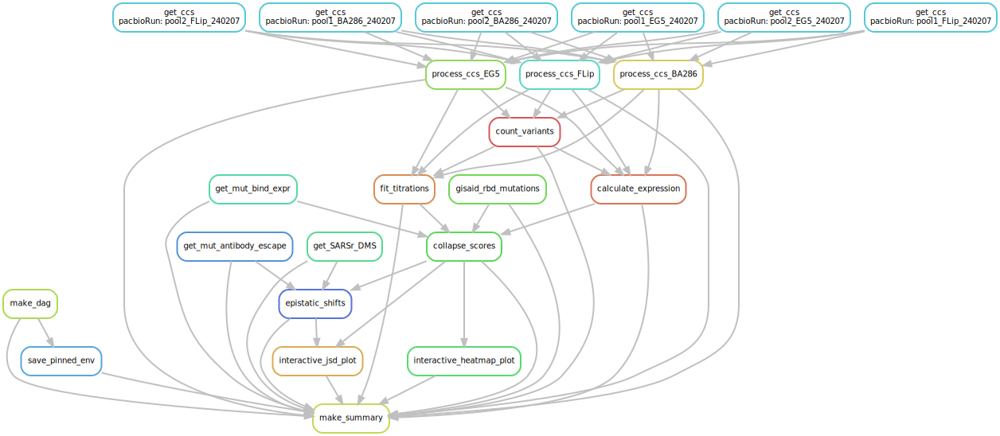

# Summary

Analysis run by [Snakefile](../../Snakefile)
using [this config file](../../config.yaml).
See the [README in the top directory](../../README.md)
for details.

Here is the DAG of the computational workflow:

Here is the Markdown output of each Jupyter notebook in the
workflow:

1. Get prior RBD DMS mutation-level binding and expression data from [prior DMS study](https://github.com/tstarrlab/SARS-CoV-2-RBD_DMS_Omicron-XBB-BQ), and SARS-CoV-1 ACE2-binding DMS data from [this repo](https://github.com/tstarrlab/SARSr-CoV-RBD_DMS).

2. Process PacBio CCSs for 
[Omicron EG.5](process_ccs_EG5.md), 
[Omicron HK.3 (i.e. FLip)](process_ccs_FLip.md), and 
[Omicron BA.2.86](process_ccs_BA286.md). Creates barcode-variant lookup tables for each background: [EG.5](../variants/codon_variant_table_EG5.csv), [FLip](../variants/codon_variant_table_FLip.csv), and [BA.2.86](../variants/codon_variant_table_BA286.csv).

3. [Count variants by barcode](count_variants.md).
   Creates a [variant counts file](../counts/variant_counts.csv)
   giving counts of each barcoded variant in each condition.

4. [Fit titration curves](compute_binding_Kd.md) to calculate per-barcode KD, recorded in [this file](../binding_Kd/bc_binding.csv).

5. [Analyze Sort-seq](compute_expression_meanF.md) to calculate per-barcode RBD expression, recorded in [this file](../expression_meanF/bc_expression.csv).

6. [Derive final genotype-level phenotypes from replicate barcoded sequences](collapse_scores.md).
   Generates final phenotypes, recorded in [this file](../final_variant_scores/final_variant_scores.csv).

7. [Count mutations in GISAID RBD sequences](gisaid_rbd_mutations.md) to create [this counts file](../GISAID_mutations/mutation_counts.csv).

8. [Analyze patterns of epistasis in the DMS data and in SARS-CoV-2 genomic data](epistatic_shifts.md).

9. Make interactive data visualizations, available [here](https://tstarrlab.github.io/SARS-CoV-2-RBD_DMS_Omicron-XBB-BQ/)